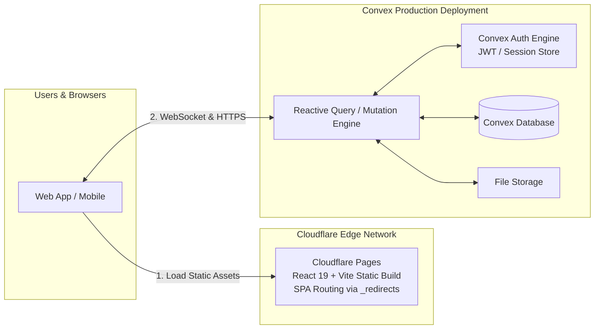

# Deployment Guide: Cloudflare Pages & Convex Backend

This comprehensive guide walks you through deploying **Kasly** to production using **Convex** for the backend database/functions/auth and **Cloudflare Pages** for global, edge-accelerated static frontend hosting.

---

## Architecture Overview



---

## Table of Contents

1. [Prerequisites](#1-prerequisites)
2. [Step 1: Deploy & Configure Convex Backend](#step-1-deploy--configure-convex-backend)
3. [Step 2: Deploy Frontend to Cloudflare Pages](#step-2-deploy-frontend-to-cloudflare-pages)
   - [Method A: Cloudflare Git Integration (Recommended)](#method-a-cloudflare-git-integration-recommended)
   - [Method B: Wrangler CLI Deployment](#method-b-wrangler-cli-deployment)
4. [Step 3: Initializing Database & Production Settings](#step-3-initializing-database--production-settings)
5. [Step 4: Custom Domain & DNS Setup (Optional)](#step-4-custom-domain--dns-setup-optional)
6. [Single Page Application (SPA) Routing](#single-page-application-spa-routing)
7. [Environment Variables Reference](#environment-variables-reference)
8. [Troubleshooting & FAQ](#troubleshooting--faq)

---

## 1. Prerequisites

Before starting, ensure you have:

* A [Convex](https://dashboard.convex.dev/) account.
* A [Cloudflare](https://dash.cloudflare.com/) account.
* [Node.js](https://nodejs.org/) (v20+ recommended) and `npm` installed.
* [Git](https://git-scm.com/) installed and repository pushed to GitHub/GitLab.

---

## Step 1: Deploy & Configure Convex Backend

### 1.1 Authenticate with Convex

In your local terminal inside the project root:

```bash
npx convex login
```

### 1.2 Deploy to Production

Deploy your schema, server functions, and indexes to your Convex production deployment:

```bash
npx convex deploy
```

> [!NOTE]
> If you haven't linked a production deployment yet, the command will prompt you to select an organization and create/link a production deployment project (e.g. `kasly-prod`).

### 1.3 Configure Convex Auth Secret Keys

Convex Auth requires a secret key for JWT token signing. Run the auth configuration tool targeting production:

```bash
npx @convex-dev/auth --prod
```

This will automatically generate and set the `JWT_PRIVATE_KEY` / `JWKS` variables on your Convex production backend.

### 1.4 Set Production `SITE_URL` on Convex

Convex Auth requires knowing your production frontend URL for session handling and redirect origins:

```bash
npx convex env set SITE_URL https://<your-cloudflare-pages-subdomain>.pages.dev --prod
```

*(You can update this later if you attach a custom domain, e.g., `https://kasly.example.com`)*

### 1.5 Note Down Production Convex URLs

In the [Convex Dashboard](https://dashboard.convex.dev/), navigate to **Settings** > **URL & Deploy Key** or run:

```bash
npx convex deployment
```

You will need:
* **Production Deployment URL**: e.g., `https://your-deployment-name.convex.cloud`
* **Production Site URL**: e.g., `https://your-deployment-name.convex.site`

---

## Step 2: Deploy Frontend to Cloudflare Pages

### Method A: Cloudflare Git Integration (Recommended)

This method connects your GitHub repository to Cloudflare Pages for automatic deployments on push.

#### 1. Create a New Pages Project
1. Log into the [Cloudflare Dashboard](https://dash.cloudflare.com/).
2. Go to **Workers & Pages** > **Overview** > **Create application** > **Pages** tab > **Connect to Git**.
3. Select your GitHub repository (`kasly`).

#### 2. Configure Build & Output Settings

Set the following configuration in the Cloudflare Pages wizard:

| Setting | Value |
| :--- | :--- |
| **Framework preset** | `Vite` *(or `None`)* |
| **Build command** | `npm run build` |
| **Build output directory** | `dist` |
| **Root directory** | `/` *(leave empty or default)* |

#### 3. Configure Environment Variables

Under **Environment variables (advanced)**, configure both **Production** and **Preview** variables:

| Variable Name | Value | Description |
| :--- | :--- | :--- |
| `VITE_CONVEX_URL` | `https://<your-deployment-name>.convex.cloud` | Public WebSocket & HTTPS Convex endpoint |
| `VITE_CONVEX_SITE_URL` | `https://<your-deployment-name>.convex.site` | Public Convex HTTP actions/storage endpoint |
| `NODE_VERSION` | `20` | Ensures Cloudflare build container uses Node.js 20+ |

#### 4. Save and Deploy
Click **Save and Deploy**. Cloudflare will run `npm run typecheck && npx vite build` and deploy your static build globally across the Cloudflare edge network.

---

### Method B: Wrangler CLI Deployment

If you prefer building locally or deploying through custom CI/CD scripts without Git linking:

#### 1. Authenticate with Wrangler

```bash
npx wrangler login
```

#### 2. Create the Cloudflare Pages Project (First Time Only)

```bash
npx wrangler pages project create kasly --production-branch main
```

#### 3. Build & Deploy

Create your production build with your production environment variables:

```bash
# Set environment variables for build
export VITE_CONVEX_URL="https://<your-deployment-name>.convex.cloud"
export VITE_CONVEX_SITE_URL="https://<your-deployment-name>.convex.site"

# Or on Windows PowerShell:
# $env:VITE_CONVEX_URL="https://<your-deployment-name>.convex.cloud"
# $env:VITE_CONVEX_SITE_URL="https://<your-deployment-name>.convex.site"

npm run build
npx wrangler pages deploy dist --project-name=kasly --branch=main
```

---

## Step 3: Initializing Database & Production Settings

Once your backend and frontend are deployed:

### 3.1 Initialize Application Settings

Populate initial system flags (organization creation, NISN verification, profile rules) by running the initialization mutation against production:

```bash
npx convex run appSettings:populate --prod
```

### 3.2 Create the First User & Organization
1. Open your deployed Cloudflare Pages URL (e.g., `https://kasly.pages.dev`).
2. Sign up for a new account with your email and password.
3. Once logged in, create your primary Organization workspace. Your account will automatically receive the **Owner** and **Admin** roles.

### 3.3 Zero-Trust Treasury Key Registration (Optional)
If utilizing the cryptographic treasury ledger:
1. Navigate to **Treasury** > **Keys** (`/treasury/keys`).
2. Generate an ECDSA P-256 keypair in your browser.
3. Submit the public key registration request and approve it with your owner/admin account.

---

## Step 4: Custom Domain & DNS Setup (Optional)

If you own a custom domain (e.g., `kasly.yourdomain.com`):

1. Go to **Cloudflare Dashboard** > **Workers & Pages** > Select your `kasly` project.
2. Navigate to **Custom Domains** tab > **Set up a custom domain**.
3. Enter your domain (e.g. `app.yourdomain.com`).
4. If your DNS is managed by Cloudflare, it will automatically configure the CNAME record and provision an SSL/TLS certificate.
5. Update your `SITE_URL` in Convex production:
   ```bash
   npx convex env set SITE_URL https://app.yourdomain.com --prod
   ```

---

## Single Page Application (SPA) Routing

Kasly uses client-side routing via `wouter`. For direct navigation or page refreshes (such as accessing `/treasury/dues` or `/organization/members` directly), the server must serve `index.html`.

This project includes a `public/_redirects` file:

```text
/* /index.html 200
```

When Vite builds the application, this file is automatically placed in `dist/_redirects`, instructing Cloudflare Pages to rewrite all route requests to `index.html` with a `200` status code.

---

## Environment Variables Reference

### Frontend Environment Variables (Cloudflare Pages)

| Variable | Required | Example | Purpose |
| :--- | :--- | :--- | :--- |
| `VITE_CONVEX_URL` | **Yes** | `https://fast-fox-123.convex.cloud` | Convex React Client connection endpoint |
| `VITE_CONVEX_SITE_URL` | **Yes** | `https://fast-fox-123.convex.site` | Convex site URL for auth and storage |
| `NODE_VERSION` | **Yes** | `20` | Specifies Node.js version for Cloudflare Pages build |

### Backend Environment Variables (Convex Production)

Set via `npx convex env set <KEY> <VALUE> --prod` or Convex Dashboard:

| Variable | Required | Managed By | Purpose |
| :--- | :--- | :--- | :--- |
| `JWT_PRIVATE_KEY` | **Yes** | `npx @convex-dev/auth --prod` | Signs JWT session tokens |
| `JWKS` | **Yes** | `npx @convex-dev/auth --prod` | Public keys for JWT validation |
| `SITE_URL` | **Yes** | CLI / Manual | Origin domain of the frontend app |

---

## Troubleshooting & FAQ

### 1. Hard refreshing a page results in a 404 error
* **Cause**: Missing SPA redirection rule on Cloudflare Pages.
* **Fix**: Ensure `public/_redirects` exists with `/* /index.html 200`. Verify that `dist/_redirects` is present after `npm run build`.

### 2. Authentication fails or redirects to localhost
* **Cause**: Convex `SITE_URL` is unset or still pointing to `http://localhost:5173`.
* **Fix**: Run `npx convex env set SITE_URL https://<your-cloudflare-pages-domain> --prod`.

### 3. Build fails on Cloudflare Pages with TypeScript or Syntax Errors
* **Cause**: Cloudflare Pages defaulting to an older Node.js version (e.g. Node 12 or 16).
* **Fix**: In Cloudflare Pages project settings, add the environment variable `NODE_VERSION` set to `20`.

### 4. How do I push database schema updates after deployment?
* Whenever you modify files in `convex/`, simply run:
  ```bash
  npx convex deploy
  ```
  Convex validates and executes schema migrations without backend downtime.

---

## Summary Checklist

- [ ] Run `npx convex deploy`
- [ ] Run `npx @convex-dev/auth --prod`
- [ ] Set `SITE_URL` in Convex (`npx convex env set SITE_URL https://... --prod`)
- [ ] Link GitHub repository to Cloudflare Pages with build command `npm run build` and directory `dist`
- [ ] Set `VITE_CONVEX_URL`, `VITE_CONVEX_SITE_URL`, and `NODE_VERSION=20` in Cloudflare Pages
- [ ] Run `npx convex run appSettings:populate --prod`
- [ ] Sign up as first admin user and create primary organization
