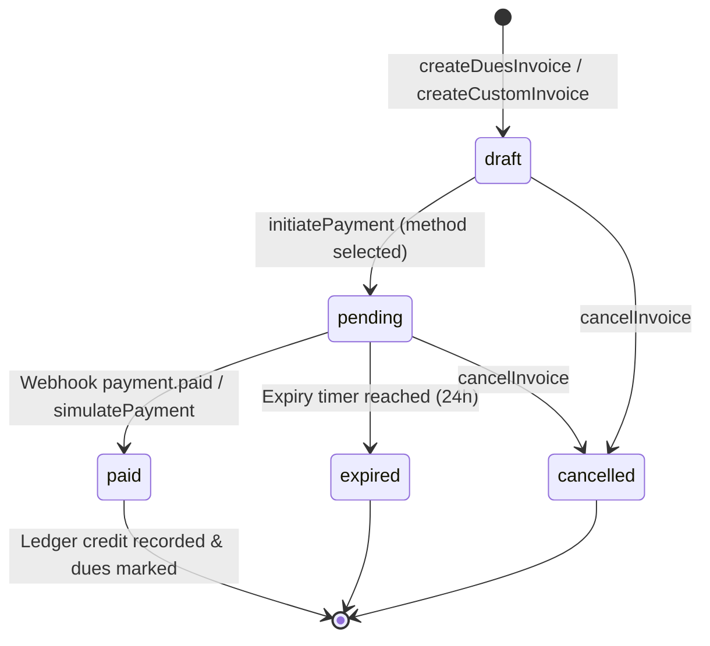

# BorderPay Payment Gateway & Invoicing Architecture

The **Kasly Invoicing and BorderPay Payment Gateway Integration** provides a zero-trust, automated financial pipeline for collecting organizational dues and custom charges through Indonesian payment rails (QRIS, Virtual Accounts, and E-Wallets). 

This system bridges real-time fiat payment settlement with Kasly's append-only **Cryptographic Ledger Engine (CLE)** via an automated, non-repudiable server-side signing architecture.

---

## 1. Core Architectural Invariants

| Principle | Architectural Rule | Technical Guarantee |
| :--- | :--- | :--- |
| **Non-Repudiable Automated Signing** | When an invoice is paid, the ledger credit entry is signed by an ECDSA P-256 key registered exclusively for the gateway. | The server signs with an organization-scoped key whose public counterpart is verified in `treasurerKeys`. Human treasurers cannot forge gateway commits. |
| **Upfront Fee Incurrence** | All gateway processing fees are paid upfront by the customer. | The organization receives 100% of the dues face value. For QRIS, where the gateway only supports merchant-borne fees, the surcharge is computed upfront and added to the gross charge. |
| **Webhook Idempotency** | Webhooks from BorderPay can be retransmitted without causing duplicate ledger entries or double dues satisfaction. | The ingestion pipeline is protected by atomic status transitions (`draft`/`pending` $\rightarrow$ `paid`), unique order IDs, and database transaction boundaries. |
| **Isolated Channel Matrix** | Organization administrators have fine-grained control over which payment channels and banks are active. | Disabled channels are omitted from the public payment method catalog and rejected during payment initiation. |
| **Zero-Secret Client Exposure** | API secret keys and private signing keys are never disclosed to the browser. | Public invoice pages query sanitized payment options and submit to Convex actions which handle upstream BorderPay API communication server-to-server. |
| **Revert Compensation Compatibility** | Dues settled through BorderPay can be reverted via standard treasury compensating transactions. | Ledger entries link back to `duesEventId` and `duesMemberships.invoiceId`, allowing automated rollback if an entry is contested. |

---

## 2. End-to-End System Architecture

```
┌─────────────────────────────────────────────────────────────────────────────────────────────┐
│                                 Organization Administrator                                  │
│                                                                                             │
│  1. Configure Gateway (API Keys, Mode) ──► savePaymentConfig()                              │
│     • Auto-generates ECDSA P-256 keypair for gateway signing                                 │
│     • Registers public key in treasurerKeys ("BorderPay Gateway System")                    │
│     • Stores private key non-extractably in organizationPaymentConfig                       │
│  2. Fetch Live Methods ──► fetchAvailablePaymentMethods() ──► Syncs /api/v1/payment-methods │
│  3. Toggle Specific Channels (QRIS, BNI, BCA, Mandiri, DANA, OVO, etc.)                     │
└──────────────────────────────────────────────┬──────────────────────────────────────────────┘
                                               │
                                               ▼
┌─────────────────────────────────────────────────────────────────────────────────────────────┐
│                                  Member / Public Payer                                      │
│                                                                                             │
│  1. Initiate Dues / Custom Checkout ──► /invoice/:invoiceNumber                             │
│  2. Select Channel (QRIS Dynamic / VA / E-Wallet) ──► initiatePayment()                     │
│  3. Pay via Banking App / E-Wallet ──► Scans QRIS / Copies VA / Submits E-Wallet            │
└──────────────────────────────────────────────┬──────────────────────────────────────────────┘
                                               │
                                               ▼
┌─────────────────────────────────────────────────────────────────────────────────────────────┐
│                                   BorderPay Payment Rails                                   │
│                                                                                             │
│  • QRIS / Virtual Account / E-Wallet Settlement Engine                                      │
│  • Dispatches Webhook to Kasly ──► POST /api/borderpay-webhook                              │
└──────────────────────────────────────────────┬──────────────────────────────────────────────┘
                                               │
                                               ▼
┌─────────────────────────────────────────────────────────────────────────────────────────────┐
│                                    Convex Server Engine                                     │
│                                                                                             │
│  1. Webhook Authentication ──► Validates x-borderpay-token against org config               │
│  2. Atomic Status Update  ──► Patches invoices record to "paid"                             │
│  3. Member Dues Satisfaction ──► Patches duesMemberships (hasPaid = true, paidAt)           │
│  4. Automated CLE Commit   ──► Builds canonical ledger payload                               │
│                            ──► Signs with Gateway Private Key (ECDSA P-256)                 │
│                            ──► Appends signed credit entry to fund ledger chain             │
│                            ──► Increments fund running balance                              │
└─────────────────────────────────────────────────────────────────────────────────────────────┘
```

---

## 3. Mathematical Fee Calculation Models

To ensure the organization receives the exact target due amount without margin erosion, fees are computed and appended upfront to the customer invoice total.

### A. QRIS Upfront Fee Model
BorderPay enforces merchant-borne fees for the national QRIS network ($0.7\%$ standard or $0.7\% + \text{Rp } 290$ for low ticket values, and $1.0\%$ for transactions $\ge \text{Rp } 100,000$). Because the gateway deducts this fee from the payout, Kasly computes the fee surcharge mathematically and appends it to the payment gross total:

$$F_{\text{QRIS}}(A) = \begin{cases} \lceil A \times 0.007 \rceil + 290, & \text{if } A < 100,000 \\ \lceil A \times 0.01 \rceil, & \text{if } A \ge 100,000 \end{cases}$$

$$\text{TotalCharged}_{\text{QRIS}} = A + F_{\text{QRIS}}(A)$$

where $A$ is the invoice subtotal (dues amount).

### B. Virtual Account (VA) Fee Model
For bank virtual accounts (BCA, BNI, BRI, Mandiri, Permata, BSI, CIMB), fees consist of a percentage component $P_{\text{VA}}$ and a fixed flat rate $K_{\text{VA}}$ obtained dynamically from the BorderPay `/api/v1/payment-methods` catalog:

$$F_{\text{VA}}(A) = \left\lceil A \times \frac{P_{\text{VA}}}{100} \right\rceil + K_{\text{VA}}$$

$$\text{TotalCharged}_{\text{VA}} = A + F_{\text{VA}}(A)$$

### C. E-Wallet Fee Model
For direct e-wallet integrations (DANA, OVO, ShopeePay, LinkAja, AstraPay), the fee is computed dynamically according to the live channel parameters:

$$F_{\text{E-Wallet}}(A) = \left\lceil A \times \frac{P_{\text{E-Wallet}}}{100} \right\rceil + K_{\text{E-Wallet}}$$

$$\text{TotalCharged}_{\text{E-Wallet}} = A + F_{\text{E-Wallet}}(A)$$

---

## 4. The Gateway Signing Key & Non-Repudiation Architecture

In standard Kasly transactions, human treasurers sign ledger entries using ECDSA P-256 private keys isolated in browser IndexedDB. Automated gateway payments cannot rely on human presence to sign entries upon webhook receipt. 

To preserve the cryptographic integrity of the ledger without compromising non-repudiation, Kasly introduces the **Organization Gateway Signing Key**:

```
                       ┌───────────────────────────────┐
                       │  savePaymentConfig() Mutation │
                       └──────────────┬────────────────┘
                                      │
                         Generates ECDSA P-256 Keypair
                                      │
               ┌──────────────────────┴──────────────────────┐
               ▼                                             ▼
┌───────────────────────────────┐             ┌───────────────────────────────┐
│     Private Key (JWK)         │             │      Public Key (JWK)         │
│  • Stored in                  │             │  • Registered in              │
│    organizationPaymentConfig  │             │    treasurerKeys table        │
│  • Never exported to client   │             │  • Labeled: "BorderPay System"│
│  • Scoped to organization     │             │  • Verified by executeCommit  │
└───────────────────────────────┘             └───────────────────────────────┘
```

### Signature Generation & Verification Mechanics
1. **Key Generation**: Upon saving BorderPay configuration, the server utilizes the W3C Web Crypto API (`crypto.subtle.generateKey`) to generate an extractable ECDSA P-256 key pair.
2. **Registration**: The public key JWK is assigned a deterministic key ID and inserted directly into `treasurerKeys` with status `active` and owner `BorderPay Gateway System`.
3. **Canonical Payload Construction**: Upon webhook validation, the server retrieves the current HEAD of the fund's ledger chain ($n = \text{sequenceNumber} + 1$, $\text{previousHash}$) and serializes the canonical transaction payload:
   ```json
   {
     "amount": 50000,
     "direction": "credit",
     "duesEventId": "jh78...",
     "entryType": "dues",
     "fundId": "kg72...",
     "keyId": "gateway_kg72..._key",
     "memo": "BorderPay payment (INV-20260924-XXXX) - Monthly dues",
     "previousHash": "e3b0c44...",
     "sequenceNumber": 12
   }
   ```
4. **ECDSA Signature**: The server signs the UTF-8 bytes with `crypto.subtle.sign({ name: "ECDSA", hash: "SHA-256" }, privateKey, payloadBytes)`. The resulting 64-byte raw IEEE P1363 signature ($r \parallel s$) is Base64URL-encoded.
5. **Ledger Commit**: The mutation passes the signed payload to `executeCommit`, which cryptographically verifies the signature against the registered public key before appending the entry to `ledgerEntries`.

---

## 5. Invoicing State Machine & Lifecycle

An invoice transitions through well-defined lifecycle states:



### State Definitions
- **`draft`**: The invoice has been generated with calculated line items and subtotal, but no payment channel has been locked yet. The payer can select or preview different payment methods and fee projections.
- **`pending`**: The payer selected a payment method (e.g., QRIS or a specific VA bank). BorderPay upstream API was called to generate the dynamic QR code string or virtual account number. The invoice is locked to this method and displays an active countdown timer.
- **`paid`**: BorderPay confirmed payment settlement via webhook or test simulation. The ledger entry has been committed and linked memberships updated.
- **`expired`**: The 24-hour payment window closed without settlement. Any subsequent webhooks for this order ID will be rejected.
- **`cancelled`**: The invoice was explicitly voided by the payer or administrator before payment completion.

---

## 6. Webhook Ingestion & Idempotency Pipeline

The webhook handler at `POST /api/borderpay-webhook` enforces multi-tenant security and zero-duplicate guarantees:

```
BorderPay HTTP Request
       │
       ▼
1. Extract Headers (x-borderpay-token)
       │
       ▼
2. Parse Body & Resolve order_id ────────► Resolve invoiceNumber
       │
       ▼
3. Query Organization Payment Config ───► Validate x-borderpay-token matches config
       │                                  (Rejects with 401 Unauthorized on mismatch)
       ▼
4. Check Current Invoice Status
       ├── Already "paid" ───────────────► Return 200 OK immediately (Idempotent bypass)
       └── "pending" or "draft"
              │
              ▼
5. Execute internalMarkInvoicePaid
       ├── Patch invoice status = "paid", paidAt = now
       ├── Update duesMemberships (hasPaid = true)
       └── Sign & commit CLE credit entry to fund ledger
              │
              ▼
6. Return 200 OK {"received": true}
```

---

## 7. BorderPay API Integration Surface

### A. Endpoint Summary
Kasly communicates with BorderPay through the following upstream endpoints:

| Endpoint | Method | Purpose |
| :--- | :---: | :--- |
| `/api/v1/payment-methods` | `GET` | Fetches live active channels, fees, and operational status |
| `/api/v1/payment/qris` | `POST` | Generates dynamic QRIS string and expiration metadata |
| `/api/v1/payment/va` | `POST` | Provisions static or dynamic Virtual Account numbers for supported banks |
| `/api/v1/payment/ewallet` | `POST` | Initiates e-wallet push payment or QR flow |
| `/api/v1/payment/simulate` | `POST` | Simulates payment settlement in sandbox/test environments |

### B. Upfront Channel Mapping & Overrides
The table `organizationPaymentConfig` stores custom channel overrides:
```json
{
  "channels": {
    "qris": true,
    "bni_va": true,
    "bca_va": false,
    "mandiri_va": true,
    "dana": true,
    "ovo": false
  }
}
```
When querying available methods for checkout via `getPublicPaymentMethods`, disabled channels are filtered out, preventing payers from selecting unsupported options.

---

## 8. Security & Compliance Invariants

1. **Token Secrecy**: The webhook verification token (`webhookToken`) is generated via high-entropy CSPRNG (`crypto.randomUUID()`) and stored securely. Incoming HTTP webhooks without a matching `x-borderpay-token` header are rejected with `401 Unauthorized`.
2. **Environment Isolation**: The configuration supports `mode: "sandbox" | "production"`. When sandbox mode is active, test payment simulation controls are surfaced exclusively to organization administrators.
3. **No Private Key Leakage**: The automated gateway private key is only read within `internalMarkInvoicePaid` server functions and is strictly omitted from all public or client-facing queries.
4. **Audit Trail Completeness**: Every gateway ledger entry includes a standardized memo referencing the unique `invoiceNumber` (e.g., `BorderPay payment (INV-20260924-A1B2) - Dues for 2 periods`), creating a permanent cryptographic link between bank rails and the internal ledger.
