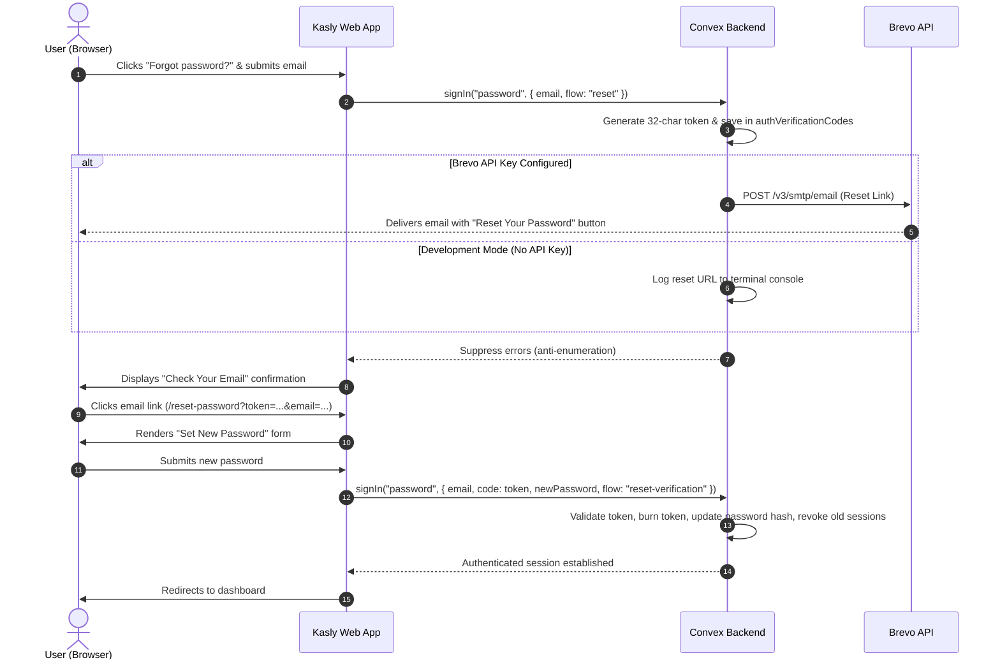

# Brevo Email & Password Reset Setup Guide

This guide details the email delivery architecture, Brevo setup procedure, and configuration for password resets in **Kasly**.

---

## 1. Overview & Architecture

Kasly handles password reset requests through [Convex Auth](https://labs.convex.dev/auth) and delivers transactional emails via [Brevo](https://www.brevo.com/) (formerly Sendinblue).

### Why Brevo REST API?
- **Zero Runtime Overhead**: Dispatches emails using native HTTPS `fetch()` calls to Brevo's Transactional Email REST API (`POST https://api.brevo.com/v3/smtp/email`).
- **No Node Dependencies**: Eliminates the need for heavy SMTP clients like `nodemailer` or Node socket shims. Runs in Convex's default isolated V8 runtime.
- **Link-Based Authentication**: Sends a secure, one-click password reset link directly to the user's inbox instead of requiring manual 6-digit code entry.
- **Development Fallback**: In local development, if no Brevo API key is configured, the system logs the full reset link to the server console so developers can test workflows without external dependencies.



---

## 2. Setting Up Brevo

Follow these steps to obtain your Brevo API key and configure a verified sender address.

### Step 1: Create a Brevo Account
1. Sign up for a free or paid account at [brevo.com](https://www.brevo.com/).
2. Complete account verification as prompted by Brevo.

### Step 2: Generate an API Key
1. From the Brevo dashboard, click your account name in the top-right corner.
2. Navigate to **SMTP & API** > **API Keys** (or go to `https://app.brevo.com/settings/keys/api`).
3. Click **Generate a new API key**.
4. Name the key (e.g. `Kasly Production` or `Kasly Local Dev`).
5. Copy the generated API key (it begins with `xkeysib-...`). Store it securely; Brevo will not show it again.

### Step 3: Add & Verify a Sender Email
1. In the Brevo dashboard, navigate to **Senders, Domains & Dedicated IPs** > **Senders** (`https://app.brevo.com/senders`).
2. Click **Add a sender**.
3. Enter the sender name (e.g. `Kasly Platform`) and email address (e.g. `noreply@yourdomain.com`).
4. Check your inbox for the verification email from Brevo and click the confirmation link.

> [!TIP]
> For optimal production deliverability and avoiding spam filters, authenticate your domain in Brevo by adding DKIM and SPF DNS records (**Senders, Domains & Dedicated IPs** > **Domains**).

---

## 3. Configuring Environment Variables

Kasly requires the following environment variables to deliver password reset emails:

| Variable | Required | Description | Example |
| :--- | :--- | :--- | :--- |
| `BREVO_API_KEY` | **Yes** (in Prod) | Master API key from Brevo dashboard | `xkeysib-abc123...` |
| `BREVO_SENDER_EMAIL` | **Yes** (in Prod) | Verified sender email in Brevo | `noreply@yourdomain.com` |
| `BREVO_SENDER_NAME` | No | Display name on outgoing emails | `Kasly Platform` (default) |
| `SITE_URL` | **Yes** | Base frontend URL for reset links | `https://kasly.pages.dev` |

### Setting Variables in Local Development

In your local `.env.local` file or via the Convex CLI:

```bash
# Set on local development Convex instance
npx convex env set BREVO_API_KEY "xkeysib-..."
npx convex env set BREVO_SENDER_EMAIL "noreply@yourdomain.com"
npx convex env set BREVO_SENDER_NAME "Kasly Platform"
npx convex env set SITE_URL "http://localhost:5173"
```

### Setting Variables in Production

Deploy variables to your Convex production deployment using the `--prod` flag:

```bash
# Set on production Convex deployment
npx convex env set BREVO_API_KEY "xkeysib-..." --prod
npx convex env set BREVO_SENDER_EMAIL "noreply@yourdomain.com" --prod
npx convex env set BREVO_SENDER_NAME "Kasly Platform" --prod
npx convex env set SITE_URL "https://<your-app>.pages.dev" --prod
```

*(You can also configure these in the [Convex Dashboard](https://dashboard.convex.dev/) under **Settings** > **Environment Variables**).*

---

## 4. Local Development Fallback Mode

To ensure developers can test authentication without needing an active Brevo account or domain:

If `BREVO_API_KEY` is **unset**, the server automatically intercepts password reset requests and prints the full reset link to the terminal running `npx convex dev`:

```
======================================================
[DEV AUTH] Brevo API Key not configured.
Password reset link for user@example.com:
http://localhost:5173/reset-password?token=abcdef1234567890abcdef1234567890&email=user%40example.com
======================================================
```

You can copy and paste this link directly into your browser to complete the password reset flow.

---

## 5. Security & Protection Features

### Anti-Account Enumeration
When a user submits a password reset request for an email address that does not exist in the database, the server catches the internal lookup failure and returns a standard success response. The frontend renders the identical **"Check Your Email"** confirmation screen. Attackers cannot query the endpoint to determine whether an email is registered.

### Single-Use High-Entropy Tokens
- Tokens are 32 random alphanumeric characters (~190 bits of entropy), making brute-force enumeration cryptographically infeasible.
- Tokens are stored in the `authVerificationCodes` table with a **15-minute Time-To-Live (TTL)**.
- Upon successful verification, the token is permanently consumed and deleted from the database.

### Session Revocation
When a password is reset via `reset-verification`, Convex Auth automatically revokes all other active sessions for that user account across devices, preventing unauthorized access if an account was previously compromised.

### Route Protection & Token Sanitization
In [`src/main.tsx`](file:///d:/coding/BoredKevin/kasly/src/main.tsx), `ConvexAuthProvider` is configured with `shouldHandleCode={() => !window.location.pathname.startsWith("/reset-password")}`. This prevents Convex Auth's default magic-link mechanism from prematurely intercepting or stripping reset URL parameters before the user submits their new password.
