# TemanQRIS Payment Gateway Integration Guide

This guide details the integration, configuration, security model, and transaction lifecycle for **TemanQRIS** within Kasly's modular payment gateway architecture.

---

## 1. Overview & Capabilities

[TemanQRIS](https://temanqris.com) is a specialized domestic payment rail that transforms an organization's existing **Static Merchant QRIS** (issued by any Indonesian bank or e-money provider like BCA, Mandiri, BRI, GoPay, or ShopeePay) into **Dynamic, Amount-Specific EMVCo QRIS codes**.

### Capability Matrix

| Feature | Support | Technical Details |
| :--- | :---: | :--- |
| **QRIS (Dynamic EMVCo)** | **Yes** | Automated generation from registered static QRIS with dynamic amounts and expiry. |
| **Virtual Accounts (VA)** | **No** | QRIS-only provider. Route VA to BorderPay via hybrid channel routing. |
| **E-Wallets (Direct Link)** | **No** | QRIS-only provider. Route E-Wallets to BorderPay via hybrid channel routing. |
| **Gateway Transaction Fee** | **Rp 0 (0%)** | Zero gateway fee on standard tier; direct settlement to merchant bank. |
| **Custom Surcharge** | **Supported** | Configurable flat Rp or percentage surcharge passed upfront to payers. |
| **Direct Customer Claim** | **Supported** | "Saya Sudah Bayar" public action calls TemanQRIS public confirmation API. |
| **Webhook Security** | **HMAC-SHA256** | `X-TemanQRIS-Signature: sha256=<hex>` verified with Web Crypto. |
| **Upstream Verification** | **Supported** | Admins can verify payments upstream via `POST /api/qris/orders/:orderId/verify`. |

---

## 2. Onboarding & Configuration Workflow

### Step 1: Register on TemanQRIS
1. Sign up at [temanqris.com](https://temanqris.com).
2. Upload your organization's official **Static QRIS** image under the **QRIS Saya** menu.
3. Ensure the QRIS status indicates **Aktif** and the National Merchant Name matches your organization.

### Step 2: Retrieve API Key & Webhook Secret
1. Navigate to **Pengaturan API** in the TemanQRIS dashboard.
2. Copy your **API Key** (`X-API-Key`).
3. Set and copy your **Webhook Secret** (used to verify HMAC-SHA256 signatures).

### Step 3: Configure Kasly Gateway Settings
1. In Kasly, navigate to **Treasury > Payment Settings**.
2. Click the **TemanQRIS** tab in the Credentials section.
3. Enter your **TemanQRIS API Key** and **Webhook Secret**.
4. Copy the displayed **Target Webhook URL**:
   ```
   https://<your-convex-site>.convex.site/api/temanqris-webhook
   ```
5. In the TemanQRIS Dashboard under **Pengaturan Webhook**, paste the Webhook URL and subscribe to:
   - `payment.paid`
   - `payment.awaiting_confirmation`

### Step 4: Configure Rail Routing
1. In the **Payment Method Routing** section:
   - **QRIS**: Select **TemanQRIS**.
   - **Virtual Accounts**: Select **BorderPay**.
   - **E-Wallets**: Select **BorderPay**.
2. Optionally configure **TemanQRIS Surcharge / Fee Settings** (default is Rp 0).
3. Click **Save Gateway Settings**.

---

## 3. Architecture & Two-Stage Settlement Lifecycle

TemanQRIS introduces a two-stage payment claim workflow designed for merchants using manual or semi-automated bank verification:

```mermaid
sequenceDiagram
    autonumber
    actor Customer as Member / Payer
    participant App as Kasly Checkout UI
    participant Router as Gateway Router
    participant TQ as TemanQRIS API
    participant Webhook as TemanQRIS Webhook Route
    participant Settlement as Universal Settlement Engine
    participant CLE as Cryptographic Ledger Engine

    Note over Customer, TQ: 1. Initiation
    Customer->>App: Clicks "Bayar dengan QRIS"
    App->>Router: initiatePayment(invoiceNumber, "qris")
    Router->>TQ: POST /api/qris/generate
    TQ-->>Router: { qris, qr_image, payment_link: { url, code } }
    Router-->>App: Display Dynamic QR Code & "Saya Sudah Bayar" Button

    Note over Customer, App: 2. Customer Claims Payment
    Customer->>App: Clicks "Saya Sudah Bayar"
    App->>Router: confirmCustomerPayment(invoiceNumber)
    Router->>TQ: POST /api/pay/:link_code/confirm
    Router->>Router: Flag invoice: isAwaitingConfirmation = true
    Note over App: Status changes to "AWAITING CONFIRMATION" (No CLE commit yet!)

    Note over TQ, CLE: 3. Verification & Settlement
    alt Automated Webhook
        TQ->>Webhook: POST /api/temanqris-webhook (X-TemanQRIS-Signature)
        Webhook->>Webhook: Verify HMAC-SHA256
        Webhook->>Settlement: settleInvoicePayment(invoiceNumber, paidAt)
    else Admin Manual Verification
        actor Admin as Organization Treasurer
        Admin->>Router: verifyAndSettleTemanQrisOrder(invoiceNumber)
        Router->>TQ: POST /api/qris/orders/:orderId/verify
        Router->>Settlement: settleInvoicePayment(invoiceNumber, paidAt)
    end

    rect rgb(20, 24, 33)
        Note over Settlement, CLE: Automated CLE Signing Ceremony
        Settlement->>CLE: executeCommit(signedPayload, signature, keyId)
        Settlement->>Settlement: Patch invoice status = "paid"
    end
```



### Critical Settlement Invariant:
> **Commitments to the Cryptographic Ledger Engine (CLE) are NEVER made on customer claim alone.**
> A payment only produces a ledger entry and updates the invoice to `paid` upon:
> 1. An incoming cryptographically validated `payment.paid` or `payment.confirmed` webhook from TemanQRIS.
> 2. An explicit manual verification by an authorized organization admin via `verifyAndSettleTemanQrisOrder`.

---

## 4. Upstream API Reference

The `TemanQrisAdapter` communicates with the following upstream endpoints (`https://temanqris.com/api/qris`):

| Endpoint | Method | Auth | Description |
| :--- | :---: | :---: | :--- |
| `/my-qris` | `GET` | `X-API-Key` | Inspect registered static QRIS details and active status. |
| `/usage` | `GET` | `X-API-Key` | Check daily order creation limits and subscription quotas. |
| `/generate` | `POST` | `X-API-Key` | Generate dynamic EMVCo QRIS string, PNG base64, and payment link code. |
| `/orders/:orderId/verify` | `POST` | `X-API-Key` | Query or trigger upstream bank verification for an order. |
| `https://temanqris.com/api/pay/:link_code/confirm` | `POST` | Public | Submit customer payment claim ("Saya Sudah Bayar"). |

### Order Generation Request Payload
```json
{
  "amount": 50000,
  "order_id": "INV-2026-0001",
  "customer_name": "Kevin Pratama",
  "customer_email": "kevin@example.com",
  "customer_phone": "08123456789",
  "callback_url": "https://your-domain.com/invoice/INV-2026-0001",
  "expired_time": 1800
}
```

---

## 5. Webhook Verification & HMAC-SHA256

Incoming webhooks are dispatched to `POST /api/temanqris-webhook`.

### Header Verification
TemanQRIS delivers a cryptographic signature header:
```http
X-TemanQRIS-Signature: sha256=d3b07384d113edec49eaa6238ad5ff00 ...
```

### Signature Computation Algorithm
1. Extract the raw hexadecimal digest following `sha256=`.
2. Compute the HMAC-SHA256 of the raw UTF-8 HTTP request body using the organization's configured `webhookSecret`:
   ```typescript
   const key = await crypto.subtle.importKey(
     "raw",
     new TextEncoder().encode(secret),
     { name: "HMAC", hash: "SHA-256" },
     false,
     ["sign"]
   );
   const signatureBuffer = await crypto.subtle.sign(
     "HMAC",
     key,
     new TextEncoder().encode(rawBody)
   );
   const computedHex = Array.from(new Uint8Array(signatureBuffer))
     .map((b) => b.toString(16).padStart(2, "0"))
     .join("");
   ```
3. Perform a constant-time comparison against the received signature. If valid, proceed to parse the event payload.

---

## 6. Upfront Fee Surcharge Model

Unlike typical payment gateways that deduct a percentage fee (e.g., 0.7% + Rp 290):
- **TemanQRIS Fee**: Rp 0.
- **Kasly Surcharge**: Configurable per organization in `methodOverrides.customQrisFee`.
  - **Flat Surcharge**: e.g., Rp 500 or Rp 1,000 platform convenience fee.
  - **Percentage Surcharge**: e.g., 0.5% or 1%.
  - **Zero Surcharge**: Rp 0 (the default, ensuring 100% face-value dues with zero surcharge to the member).

Fee formula applied during invoice creation and checkout:
$$\text{TotalCharged} = \text{Invoice Subtotal} + \text{customQrisFee}$$

---

## 7. Troubleshooting & Common Questions

### Q: Why does the QR code show "Awaiting Verification"?
When a member clicks **"Saya Sudah Bayar"**, the invoice status is flagged with `isAwaitingConfirmation: true`. The status remains pending until either:
- The payment webhook callback arrives from TemanQRIS.
- An admin clicks **"Verify"** in the **Invoices** pane.

### Q: Can TemanQRIS handle Virtual Accounts or Credit Cards?
No. TemanQRIS is an EMVCo QRIS specialist. Kasly's **Hybrid Multi-Provider Architecture** allows you to use TemanQRIS for QRIS while simultaneously routing Virtual Accounts and E-Wallets to BorderPay.
