# Modular Payment Gateway Architecture & Extensibility Guide

Kasly's **Modular Payment Gateway System** decouples real-time payment collection, merchant rail integrations, and transaction fee models from the core **Invoicing Domain** and the **Cryptographic Ledger Engine (CLE)**.

This architecture enables Kasly to support any payment gateway (domestic Indonesian rails such as BorderPay, Midtrans, Xendit, or international processors like Stripe) through a uniform adapter contract while preserving non-repudiation, zero-secret client exposure, and mathematical ledger consistency.

---

## 1. Architectural Principles & Invariants

| Principle | Architectural Rule | Technical Guarantee |
| :--- | :--- | :--- |
| **Separation of Invoicing & Settlement** | An invoice represents a financial obligation; it exists independently of the payment rail used to settle it. | Creating, listing, calculating line items, and cancelling invoices require zero knowledge of specific payment gateways. |
| **Adapter Pattern & Open-Closed Principle** | Adding a new payment gateway requires authoring a single isolated adapter implementing `PaymentGatewayAdapter` without modifying core domain code. | The system is open for gateway expansion but closed for modification in the invoicing, ledger, and member dues modules. |
| **Unified Ledger Settlement** | Regardless of which gateway collects the funds, ledger credit commits are signed by the organization's automated gateway key. | Webhook verification is gateway-specific; once verified, settlement passes to a universal, non-repudiable CLE commit pipeline. |
| **Normalized Payment Capabilities** | Different gateways represent payment channels with divergent structures. The gateway layer standardizes all channels into unified structures (`NormalizedPaymentMethod`). | Checkout surfaces (QRIS, Virtual Accounts, E-Wallets, Cards) render identically across all underlying providers. |
| **Upfront Fee Surcharge Model** | Gateway surcharges are computed dynamically before transaction initiation and added to the customer total. | Organizations always receive 100% of the dues/invoice face value with zero net revenue erosion. |
| **Webhook Idempotency & Defense in Depth** | Webhooks must be verified using provider-specific cryptographic signatures or tokens before reaching the settlement engine. | Replay attacks, duplicate webhooks, or malformed callbacks cannot trigger multiple ledger credits. |

---

## 2. System Architecture & Component Hierarchy

The payment processing subsystem is structured into five distinct, decoupled layers:

```
┌────────────────────────────────────────────────────────────────────────────────────────┐
│                                  PRESENTATION LAYER                                    │
│                                                                                        │
│   • /invoice/:invoiceNumber (Public checkout & payment detail views)                   │
│   • InvoicesPane (Admin invoice list, status filters, payment auditing)                │
│   • CreateCustomInvoiceModal / CreateInvoiceModal (Dues & custom charge generation)    │
│   • PaymentGatewayCard (Gateway credentials, channel overrides, mode toggles)          │
└────────────────────────────────────────┬───────────────────────────────────────────────┘
                                         │
                                         ▼
┌────────────────────────────────────────────────────────────────────────────────────────┐
│                              APPLICATION SERVICE LAYER                                 │
│                                                                                        │
│   • convex/treasury/invoices.ts       ──► Invoice lifecycle (draft/pending/paid/etc.) │
│   • convex/treasury/settlement.ts     ──► Automated CLE signing & membership updates   │
│   • convex/treasury/gateways/router.ts──► Provider dispatch & channel aggregation      │
└───────────────────┬────────────────────────────────────────────┬───────────────────────┘
                    │                                            │
                    ▼                                            ▼
┌──────────────────────────────────────┐     ┌───────────────────────────────────────────┐
│     GATEWAY ABSTRACTION LAYER        │     │         LEDGER / CLE CORE ENGINE          │
│                                      │     │                                           │
│  • PaymentGatewayAdapter (Contract)  │     │  • executeCommit (ECDSA verification)     │
│  • GatewayRegistry (Factory)         │     │  • treasurerKeys (Automated Gateway Key)  │
│  • Normalized Data Models            │     │  • ledgerEntries (Append-only hash chain) │
└───────────────────┬──────────────────┘     └───────────────────────────────────────────┘
                    │
                    ▼
┌────────────────────────────────────────────────────────────────────────────────────────┐
│                           CONCRETE PROVIDER ADAPTERS                                   │
│                                                                                        │
│  ┌───────────────────────┐  ┌───────────────────────┐  ┌────────────────────────────┐  │
│  │   BorderPay Adapter   │  │   Midtrans Adapter    │  │   Stripe / Xendit Adapter  │  │
│  │  (Currently Active)   │  │      (Future)         │  │          (Future)          │  │
│  └───────────────────────┘  └───────────────────────┘  └────────────────────────────┘  │
└────────────────────────────────────────────────────────────────────────────────────────┘
```

---

## 3. Core Domain Interfaces (`convex/treasury/gateways/types.ts`)

Every concrete payment gateway integrates with Kasly by implementing the `PaymentGatewayAdapter` interface.

### A. The Adapter Contract

```typescript
export interface PaymentGatewayAdapter {
  /**
   * Unique machine-readable identifier for the provider (e.g. "borderpay", "midtrans", "stripe")
   */
  readonly provider: string;

  /**
   * Human-readable display label (e.g. "BorderPay (QRIS & VA)")
   */
  readonly displayName: string;

  /**
   * Computes the processing fee for a given method and gross subtotal.
   */
  calculateFee(
    subtotal: number,
    channelType: PaymentChannelType,
    channelCode?: string,
    rawMetadata?: unknown
  ): number;

  /**
   * Fetches the live catalog of available payment rails from the gateway's upstream API.
   */
  fetchPaymentMethods(
    ctx: ActionCtx,
    config: GatewayConfigRecord
  ): Promise<NormalizedPaymentMethod[]>;

  /**
   * Initiates a payment session with upstream rails (generating QRIS string, VA number, etc.)
   */
  initiatePayment(
    ctx: ActionCtx,
    config: GatewayConfigRecord,
    request: PaymentInitiationRequest
  ): Promise<PaymentInitiationResult>;

  /**
   * Cryptographically verifies and normalizes an incoming HTTP webhook.
   */
  verifyAndParseWebhook(
    ctx: ActionCtx,
    request: WebhookVerificationRequest
  ): Promise<WebhookVerificationResult>;

  /**
   * Optional sandbox simulation of payment settlement for automated tests and admin verification.
   */
  simulatePayment?(
    ctx: ActionCtx,
    config: GatewayConfigRecord,
    request: PaymentSimulationRequest
  ): Promise<PaymentSimulationResult>;
}
```

### B. Normalized Data Models

```typescript
export type PaymentChannelType = "qris" | "va" | "ewallet" | "card" | "bank_transfer" | "other";

export interface NormalizedPaymentMethod {
  id: string;                      // Unique channel identifier (e.g. "borderpay:bni_va")
  channelType: PaymentChannelType; // High-level grouping
  code: string;                     // Bank/Wallet code (e.g. "BNI", "BCA", "DANA")
  name: string;                     // Display name (e.g. "BNI Virtual Account")
  logoUrl?: string;
  minAmount?: number;
  maxAmount?: number;
  fee: {
    flat: number;                   // Flat fee in smallest currency units (e.g. IDR 4,200)
    percent: number;                // Percentage fee (e.g. 0.7 for 0.7%)
  };
  provider: string;                // "borderpay"
  isEnabled: boolean;
}

export interface PaymentInitiationRequest {
  invoice: Doc<"invoices">;
  channelType: PaymentChannelType;
  channelCode?: string;
  returnUrl?: string;
  customer?: {
    name: string;
    email?: string;
    phone?: string;
  };
}

export interface PaymentInitiationResult {
  provider: string;
  providerReferenceId: string;
  qrString?: string;
  vaNumber?: string;
  vaBank?: string;
  payUrl?: string;
  checkoutUrl?: string;
  expiresAt: number;
  fee: number;
  totalAmount: number;
  rawResponse?: unknown;
}

export interface WebhookVerificationRequest {
  headers: Record<string, string>;
  bodyText: string;
  parsedBody?: unknown;
}

export interface WebhookVerificationResult {
  isValid: boolean;
  error?: string;
  eventType: "payment.paid" | "payment.expired" | "payment.failed" | "ignored";
  invoiceNumber: string;
  providerReferenceId?: string;
  amountPaid?: number;
  paidAt?: number;
  rawPayload?: unknown;
}
```

---

## 4. The Gateway Registry & Dispatcher (`registry.ts` & `router.ts`)

### A. Registry Mechanism
The `GatewayRegistry` holds active adapter instances indexed by their `provider` string:

```typescript
class GatewayRegistry {
  private adapters = new Map<string, PaymentGatewayAdapter>();

  public register(adapter: PaymentGatewayAdapter): void {
    if (this.adapters.has(adapter.provider)) {
      throw new Error(`Gateway adapter '${adapter.provider}' is already registered.`);
    }
    this.adapters.set(adapter.provider, adapter);
  }

  public get(provider: string): PaymentGatewayAdapter {
    const adapter = this.adapters.get(provider);
    if (!adapter) {
      throw new Error(`Payment gateway provider '${provider}' is not supported or registered.`);
    }
    return adapter;
  }

  public list(): PaymentGatewayAdapter[] {
    return Array.from(this.adapters.values());
  }
}

export const registry = new GatewayRegistry();
// Register active adapters:
registry.register(new BorderPayAdapter());
```

### B. Routing & Aggregation
When the frontend requests payment options or initiates checkout:
1. `router.fetchAvailablePaymentMethods`: Identifies the organization's configured provider, fetches methods via `adapter.fetchPaymentMethods`, and applies organization channel overrides (`methodOverrides`).
2. `router.initiatePayment`: Resolves the invoice, selects the appropriate adapter, computes upfront fees via `adapter.calculateFee`, calls `adapter.initiatePayment`, and records the generic payment instructions on the invoice record.

---

## 5. Universal Ledger Settlement Engine (`convex/treasury/settlement.ts`)

In Kasly, payment settlement is completely decoupled from payment rails. The settlement engine guarantees that any valid payment proof produces an immutable, cryptographically signed ledger entry.

```mermaid
sequenceDiagram
    autonumber
    actor Payer as Member / Public Payer
    participant Bank as Gateway / Bank Rail
    participant HTTP as Convex HTTP Webhook Router
    participant Adapter as Gateway Adapter (e.g. BorderPay)
    participant Settlement as Universal Settlement Engine
    participant CLE as Cryptographic Ledger Engine (CLE)
    participant DB as Convex Database

    Payer->>Bank: Completes Payment (QRIS / VA / E-Wallet)
    Bank->>HTTP: POST Webhook Callback
    HTTP->>Adapter: verifyAndParseWebhook(headers, body)
    Adapter-->>HTTP: WebhookVerificationResult (isValid: true, invoiceNumber, paidAt)
    HTTP->>Settlement: settleInvoicePayment(invoiceNumber, paidAt, metadata)
    
    rect rgb(20, 24, 33)
        Note over Settlement, CLE: Non-Repudiable Automated Signing Ceremony
        Settlement->>DB: Check invoice status (idempotency guard)
        Settlement->>DB: Fetch Fund HEAD state & Gateway Signing Key (JWK)
        Settlement->>Settlement: Build Canonical JSON Signing Payload
        Settlement->>Settlement: Sign with ECDSA P-256 (Web Crypto)
        Settlement->>CLE: executeCommit(signedPayload, signature, keyId)
        CLE->>DB: Append to ledgerEntries & update running balance
        Settlement->>DB: Patch invoice (status: "paid", paidAt)
        Settlement->>DB: Patch duesMemberships (hasPaid: true, paidAt)
    end

    Settlement-->>HTTP: { success: true }
    HTTP-->>Bank: 200 OK {"received": true}
```



### Key Security Invariants in Settlement:
1. **Automated Gateway Key Registration**: The signing key is scoped to the organization and registered in `treasurerKeys` under the label `Automated Gateway System Key`.
2. **Deterministic Canonical Serialization**: The payload fields (`amount`, `direction`, `duesEventId`, `entryType`, `fundId`, `keyId`, `memo`, `previousHash`, `sequenceNumber`) are canonically ordered before ECDSA P-256 signing.
3. **Idempotency Guarantee**: If multiple webhook deliveries occur for the same invoice, step 1 verifies `invoice.status === "paid"`. Subsequent deliveries short-circuit immediately with `200 OK`, avoiding OCC database conflicts or duplicate ledger credits.

---

## 6. Webhook Ingestion & HTTP Routing Pipeline (`convex/http.ts`)

To ensure zero downtime during rollout and backwards compatibility with existing BorderPay configurations:

1. **Legacy Webhook Route**: `/api/borderpay-webhook` remains active and delegates directly to the BorderPay adapter.
2. **Universal Webhook Route**: `/api/webhooks/payment/:provider` is introduced for future gateways.

```typescript
http.route({
  path: "/api/borderpay-webhook",
  method: "POST",
  handler: httpAction(async (ctx, req) => {
    return handleGatewayWebhook(ctx, req, "borderpay");
  }),
});
```

---

## 7. How to Implement a New Gateway in 4 Steps

To illustrate the modularity of the system, adding a new gateway (e.g., Midtrans or Xendit) requires **zero modifications** to the Invoicing or Settlement modules:

### Step 1: Create the Adapter File
Create `convex/treasury/gateways/adapters/<provider>.ts`:

```typescript
export class MidtransAdapter implements PaymentGatewayAdapter {
  readonly provider = "midtrans";
  readonly displayName = "Midtrans Payment Gateway";

  calculateFee(subtotal: number, channelType: PaymentChannelType, channelCode?: string): number {
    if (channelType === "qris") return Math.ceil(subtotal * 0.007);
    if (channelType === "va") return 4000;
    return 0;
  }

  async fetchPaymentMethods(ctx: ActionCtx, config: GatewayConfigRecord): Promise<NormalizedPaymentMethod[]> {
    // 1. Fetch available payment channels from Midtrans API
    // 2. Return NormalizedPaymentMethod[]
  }

  async initiatePayment(ctx: ActionCtx, config: GatewayConfigRecord, req: PaymentInitiationRequest): Promise<PaymentInitiationResult> {
    // 1. Call Midtrans Core API / Snap API
    // 2. Return Normalized PaymentInitiationResult
  }

  async verifyAndParseWebhook(ctx: ActionCtx, req: WebhookVerificationRequest): Promise<WebhookVerificationResult> {
    // 1. Verify Midtrans SHA-512 signature hash (order_id + status_code + gross_amount + ServerKey)
    // 2. Return WebhookVerificationResult with invoiceNumber and eventType
  }
}
```

### Step 2: Register the Adapter in `registry.ts`
```typescript
import { MidtransAdapter } from "./adapters/midtrans";
registry.register(new MidtransAdapter());
```

### Step 3: Register the Webhook Route in `convex/http.ts`
```typescript
http.route({
  path: "/api/midtrans-webhook",
  method: "POST",
  handler: httpAction(async (ctx, req) => handleGatewayWebhook(ctx, req, "midtrans")),
});
```

### Step 4: Configure Frontend Credentials Card
Expose the provider configuration in `PaymentGatewayCard.tsx`.

---

## 8. Upfront Customer-Borne Fee Architecture

To protect organizations from margin erosion and maintain 100% dues collection integrity:
1. **Payer-Borne Fee Principle**: Payment gateway processing fees are borne entirely by the customer at checkout:
   $$\text{TotalCharged} = \text{Invoice Subtotal} + \text{Gateway Fee}$$
2. **Checkout Fee Synchronization Lifecycle**:
   - When a payer navigates to `/invoice/:invoiceNumber`, the checkout view dispatches `syncCheckoutPaymentMethods({ invoiceNumber })`.
   - The router queries upstream gateway rails (`adapter.fetchPaymentMethods`), refreshing the fee schedule and active channels into the database cache.
   - The checkout breakdown renders reactive fee line items (`+Rp 290` / `+Rp 4.200` / `+2%`) directly on the payment rail buttons and summary breakdown before payment initiation.
3. **Automated CLE Settlement**:
   - When payment is confirmed via webhook or sandbox simulation, `settlement.ts` commits exactly `invoice.subtotal` into the organization's cryptographically signed ledger.
   - The organization receives 100% of the face value of the invoice.

---

## 9. Migration & Backward Compatibility Verification

To avoid breaking active deployments, invoices in transit, or existing database records:
- **`borderpayReferenceId` Field Alias**: The `invoices` schema maintains `borderpayReferenceId` alongside `gatewayReferenceId`.
- **Public API Facade**: `convex/treasury/borderpay.ts` continues to export existing query and mutation symbols (`getInvoice`, `listInvoices`, `createDuesInvoice`, `initiatePayment`, `syncCheckoutPaymentMethods`), delegating under the hood to `invoices.ts` and `gateways/router.ts`.
- **No Database Lockups**: Existing `organizationPaymentConfig` rows remain valid without requiring an emergency database migration.
