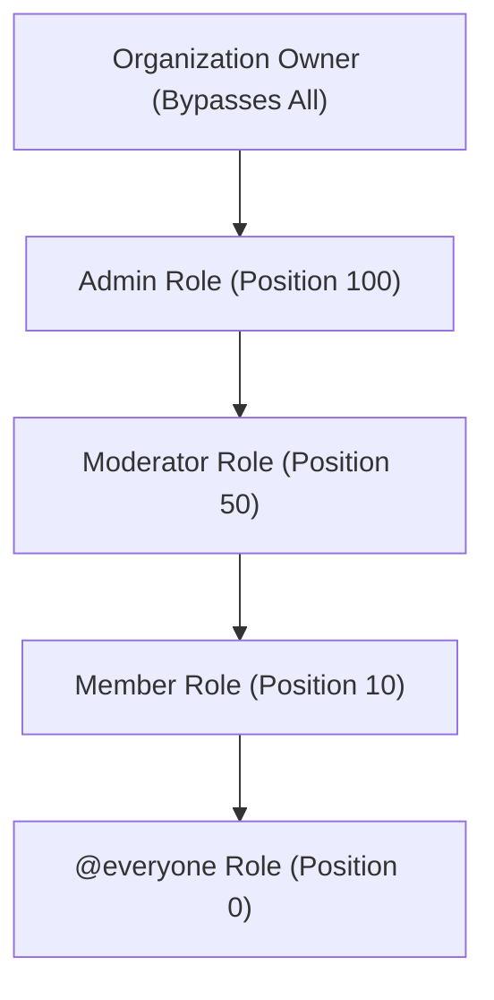

# Role-Based Access Control (RBAC) & Security Specification

Kasly implements a **Discord-style hierarchical RBAC engine**. This document specifies the permission catalog, mathematical hierarchy models, authorization helpers, and security invariants defined across [convex/permissions.ts](file:///d:/coding/BoredKevin/kasly/convex/permissions.ts) and [convex/authz.ts](file:///d:/coding/BoredKevin/kasly/convex/authz.ts).

---

## 1. Core Principles

1. **Owner Supremacy**: The organization creator (`ownerId`) is the supreme superuser. The owner bypasses all permission and hierarchy checks and cannot be demoted, kicked, or banned.
2. **Permission Aggregation**: A member inherits the union of permissions from the default `@everyone` role plus all custom roles assigned to them.
3. **Hierarchy Boundaries**: All administrative and moderation actions are bounded by role hierarchy (`position`). An actor cannot perform actions on roles or members of equal or higher rank.
4. **Instant Ban Enforcement**: Banned users are instantly blocked at the database query/mutation level.

---

## 2. Granular Permissions Catalog

Permissions are declared as constant strings in [convex/permissions.ts](file:///d:/coding/BoredKevin/kasly/convex/permissions.ts):

| Category | Permission Constant | Description | Default `@everyone` | Default `Admin` |
| :--- | :--- | :--- | :---: | :---: |
| **Administration** | `ADMINISTRATOR` | Grants all permissions and bypasses individual permission checks. (Still subject to hierarchy). | No | Yes |
| **Administration** | `MANAGE_ORGANIZATION` | Ability to update organization name, description, slug, icon, and server settings. | No | Yes (via Admin) |
| **Administration** | `VIEW_AUDIT_LOG` | Read access to organization audit and moderation logs. | No | Yes (via Admin) |
| **Roles** | `MANAGE_ROLES` | Ability to create, update, delete, and reorder roles with lower position than actor. | No | Yes (via Admin) |
| **Members** | `MANAGE_MEMBERS` | Ability to edit other members' nicknames and assign roles lower than actor. | No | Yes (via Admin) |
| **Members** | `VIEW_EMAILS` | Ability to view members' real email addresses (PII data protection). | No | Yes (via Admin) |
| **Moderation** | `KICK_MEMBERS` | Ability to kick members who have a lower hierarchy position. | No | Yes (via Admin) |
| **Moderation** | `BAN_MEMBERS` | Ability to ban and unban members who have a lower hierarchy position. | No | Yes (via Admin) |
| **Invites** | `CREATE_INVITES` | Ability to generate shareable invite links for the organization. | Yes | Yes (via Admin) |
| **Invites** | `MANAGE_INVITES` | Ability to view all active invite links and revoke existing invites. | No | Yes (via Admin) |
| **Content** | `VIEW_ORGANIZATION` | Basic read access to view organization profile,  member list. | Yes | Yes (via Admin) |
| **Content** | `CREATE_CONTENT` | Create messages, posts, numbers, and org-scoped resources. | Yes | Yes (via Admin) |
| **Content** | `MANAGE_CONTENT` | Edit or delete content created by any user within the organization. | No | Yes (via Admin) |
| **Treasury** | `VIEW_TREASURY` | View funds, read derived balances, and inspect audit ledger. | Yes | Yes (via Admin) |
| **Treasury** | `SIGN_TREASURY` | Request key registration, digitally sign and commit ledger transactions. | No | Yes (via Admin) |
| **Treasury** | `MANAGE_TREASURY` | Create/archive funds, approve/revoke keys, create checkpoints, export audits. | No | Yes (via Admin) |

---

## 3. The Role Hierarchy Engine

### Hierarchy Calculation Rules

Every role has an integer `position` attribute:
* **Position 0**: Reserved exclusively for `@everyone` (`isDefault: true`).
* **Position 1 to $\infty$**: Custom roles created by administrators.
* **Position 100**: Default `Admin` role created at organization setup.



### Highest Role Position Formula

A member's effective hierarchy rank $P(m)$ is defined as:
$$P(m) = \begin{cases} \infty & \text{if } \text{userId} = \text{org.ownerId} \\ \max(\{0\} \cup \{ r.\text{position} \mid r \in \text{roles}(m) \}) & \text{otherwise} \end{cases}$$

Where $\text{roles}(m)$ are the roles assigned to member $m$.

### Permission Resolution Algorithm

For any member $m$ in organization $O$, effective permissions $E(m)$ are resolved by [resolveMemberPermissions](file:///d:/coding/BoredKevin/kasly/convex/authz.ts):

1. If $m.\text{userId} = O.\text{ownerId}$, return `ALL_PERMISSIONS`.
2. Fetch the default `@everyone` role for organization $O$.
3. Fetch all assigned roles $r \in m.\text{roleIds}$.
4. Compute $U = \text{everyone}.\text{permissions} \cup \bigcup_{r} r.\text{permissions}$.
5. If `ADMINISTRATOR` $\in U$, return `ALL_PERMISSIONS`.
6. Otherwise, return $U$.

---

## 4. Security Invariants & Guardrails

### A. Privilege Escalation Prevention (`assertCanManageRole`)
When creating, editing, reordering, or assigning a role to a member:
$$\text{Actor Position } P(\text{actor}) > \text{Target Role Position } P(\text{role})$$

```ts
if (!isOwner && actorHighestPosition <= targetRolePosition) {
  throw new Error("Forbidden: You cannot manage a role equal to or higher than your highest role.");
}
```

* **Effect**: An admin at position 50 cannot create or grant a role at position 50 or above, nor can they edit the permissions of higher roles.

### B. Moderation Target Protection (`assertCanManageTargetMember`)
When kicking, banning, or editing the profile/roles of a target member:
$$\text{Actor Position } P(\text{actor}) > \text{Target Position } P(\text{target})$$

* **Owner Immunity**: Target cannot be the organization owner under any circumstances.
* **Self-Action Constraint**: An actor cannot kick or ban themselves (must use `leaveOrganization`).

### C. System Role Immutability
* The `@everyone` role cannot be deleted, renamed, or assigned a position other than `0`.
* Roles flagged with `isSystem: true` cannot be deleted.

### D. Ban Enforcement (`requireNotBanned`)
* Every organization entrypoint validates that `bans` does not contain a record for `(organizationId, userId)`.
* If a ban is detected, execution throws `403 Forbidden: You are banned from this organization` immediately.

---

## 5. Authorization Helper Reference

Defined in [convex/authz.ts](file:///d:/coding/BoredKevin/kasly/convex/authz.ts):

| Helper Function | Return Type | Throws On Failure | Description |
| :--- | :--- | :---: | :--- |
| `getCurrentUser(ctx)` | `Doc<"users"> \| null` | No | Retrieves current user or null. |
| `requireUser(ctx)` | `Doc<"users">` | 401 | Asserts caller is logged in. |
| `getMember(ctx, orgId, userId)` | `Doc<"members"> \| null` | No | Fetches member record. |
| `requireMember(ctx, orgId, userId)` | `Doc<"members">` | 403 | Asserts user is in the organization. |
| `requireNotBanned(ctx, orgId, userId)` | `void` | 403 | Asserts user is not in the ban list. |
| `isOrganizationOwner(org, userId)` | `boolean` | No | Checks if user is the owner. |
| `requireOrganizationOwner(ctx, orgId, userId)` | `Doc<"organizations">` | 403 | Asserts user is the owner. |
| `getHighestRolePosition(ctx, orgId, member)` | `number` | No | Returns integer hierarchy score. |
| `hasPermission(ctx, orgId, userId, perm)` | `boolean` | No | Checks permission without throwing. |
| `requirePermission(ctx, orgId, perm)` | `{ user, org, member }` | 401/403 | Primary guard for protected mutations/queries. |
| `assertCanManageRole(ctx, org, member, pos)` | `void` | 403 | Enforces role management hierarchy. |
| `assertCanManageTargetMember(ctx, org, actor, target)` | `void` | 403 | Enforces moderation hierarchy bounds. |
