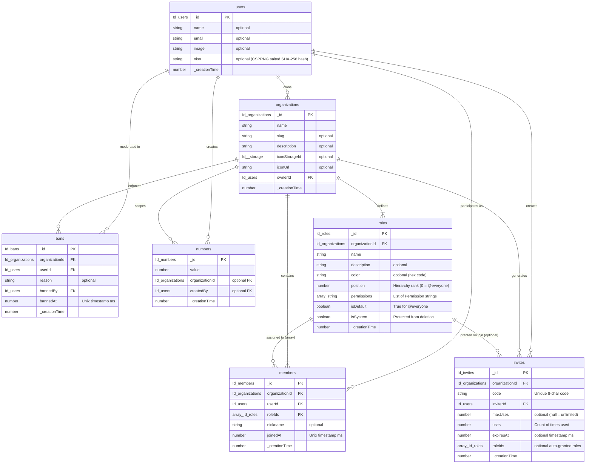

# Database Schema & Data Model

This document provides a comprehensive reference for Kasly's relational document model defined in [convex/schema.ts](file:///d:/coding/BoredKevin/kasly/convex/schema.ts).

---

## 1. Entity-Relationship Diagram (ERD)

---

## 2. Table Specifications

### `users`
Represents a user account provisioned via Convex Auth, extended with profile and private identification data.

| Field | Type | Required | Description |
| :--- | :--- | :---: | :--- |
| `_id` | `Id<"users">` | Yes | Primary document ID |
| `name` | `string` | No | User display name |
| `email` | `string` | No | Primary email address |
| `image` | `string` | No | Optional avatar image URL |
| `nisn` | `string` | No | Private 10-digit identification number stored as a salted SHA-256 hash (`v1$<saltHex>$<hashHex>`). Immutable by regular users. |
| `_creationTime` | `number` | Yes | Epoch timestamp (ms) when account was registered |

**Indexes:**
* `email` on `["email"]` — Unique lookup and email authentication sync.
* `phone` on `["phone"]` — Phone authentication lookup.

---

### `organizations`
Represents a workspace or server (analogous to a Discord Guild).

| Field | Type | Required | Description |
| :--- | :--- | :---: | :--- |
| `_id` | `Id<"organizations">` | Yes | Primary document ID |
| `name` | `string` | Yes | Name of the organization |
| `slug` | `string` | No | Optional URL-friendly unique identifier |
| `description` | `string` | No | Short bio or server purpose |
| `iconStorageId` | `Id<"_storage">` | No | Reference to Convex storage for uploaded avatar |
| `iconUrl` | `string` | No | Direct URL of the server avatar |
| `ownerId` | `Id<"users">` | Yes | ID of the organization owner (Superuser) |

**Indexes:**
* `by_ownerId` on `["ownerId"]` — Quickly list all organizations owned by a user.
* `by_slug` on `["slug"]` — Fast lookups for human-readable vanity URLs.

---

### `roles`
Defines permissions, colors, and hierarchical standing within an organization.

| Field | Type | Required | Description |
| :--- | :--- | :---: | :--- |
| `_id` | `Id<"roles">` | Yes | Primary document ID |
| `organizationId` | `Id<"organizations">` | Yes | Owning organization |
| `name` | `string` | Yes | Display name (e.g. `@everyone`, `Admin`, `Moderator`) |
| `description` | `string` | No | Description of the role's purpose |
| `color` | `string` | No | Hex color code (e.g., `#5865F2`) for user badges |
| `position` | `number` | Yes | Integer ranking ($0$ = `@everyone`; higher number = higher authority) |
| `permissions` | `Array<string>` | Yes | List of granted permission constants |
| `isDefault` | `boolean` | Yes | `true` only for the baseline `@everyone` role |
| `isSystem` | `boolean` | No | `true` for system-protected roles that cannot be deleted |

**Indexes:**
* `by_organizationId` on `["organizationId"]` — Fetch all roles for an organization.
* `by_organizationId_and_position` on `["organizationId", "position"]` — Retrieve roles pre-sorted by hierarchy rank.
* `by_organizationId_and_isDefault` on `["organizationId", "isDefault"]` — Lookup the default `@everyone` role in $O(1)$.

---

### `members`
Represents a user's membership and granted roles within a specific organization.

| Field | Type | Required | Description |
| :--- | :--- | :---: | :--- |
| `_id` | `Id<"members">` | Yes | Primary document ID |
| `organizationId` | `Id<"organizations">` | Yes | Target organization |
| `userId` | `Id<"users">` | Yes | User account reference |
| `roleIds` | `Array<Id<"roles">>` | Yes | Array of assigned custom/admin role IDs |
| `nickname` | `string` | No | Server-specific custom display nickname |
| `joinedAt` | `number` | Yes | Epoch timestamp (ms) of when the member joined |

**Indexes:**
* `by_organizationId_and_userId` on `["organizationId", "userId"]` — $O(1)$ lookup to verify membership and fetch role IDs.
* `by_userId` on `["userId"]` — Efficiently list all organizations a user belongs to.
* `by_organizationId` on `["organizationId"]` — List all members belonging to an organization.

---

### `invites`
Stores shareable invitation links for onboarding users into an organization.

| Field | Type | Required | Description |
| :--- | :--- | :---: | :--- |
| `_id` | `Id<"invites">` | Yes | Primary document ID |
| `organizationId` | `Id<"organizations">` | Yes | Organization the invite grants access to |
| `code` | `string` | Yes | Unique 8-character alphanumeric string |
| `inviterId` | `Id<"users">` | Yes | User who generated the invitation |
| `maxUses` | `number` | No | Max allowed redemptions (`undefined` = unlimited) |
| `uses` | `number` | Yes | Counter tracking how many times the link was redeemed |
| `expiresAt` | `number` | No | Expiration timestamp in ms (`undefined` = never expires) |
| `roleIds` | `Array<Id<"roles">>` | No | Optional roles automatically assigned upon joining |

**Indexes:**
* `by_code` on `["code"]` — Instant invite resolution when a user visits an invite link.
* `by_organizationId` on `["organizationId"]` — List and audit active invites within an organization.

---

### `bans`
Maintains the organization blacklist for moderated users.

| Field | Type | Required | Description |
| :--- | :--- | :---: | :--- |
| `_id` | `Id<"bans">` | Yes | Primary document ID |
| `organizationId` | `Id<"organizations">` | Yes | Organization context |
| `userId` | `Id<"users">` | Yes | Banned user account ID |
| `reason` | `string` | No | Audit reason provided by moderator |
| `bannedBy` | `Id<"users">` | Yes | Moderator who executed the ban |
| `bannedAt` | `number` | Yes | Epoch timestamp (ms) when the ban took effect |

**Indexes:**
* `by_organizationId_and_userId` on `["organizationId", "userId"]` — Instant ban validation check during all authorization flows.
* `by_organizationId` on `["organizationId"]` — List all banned users in the moderation settings.

---

### `numbers`
Demonstration org-scoped resource showcasing RBAC permission-guarded CRUD.

| Field | Type | Required | Description |
| :--- | :--- | :---: | :--- |
| `_id` | `Id<"numbers">` | Yes | Primary document ID |
| `value` | `number` | Yes | Numerical payload |
| `organizationId` | `Id<"organizations">` | No | Organization context |
| `createdBy` | `Id<"users">` | No | User who added the record |

**Indexes:**
* `by_organizationId` on `["organizationId"]` — Retrieve numbers belonging to a specific organization.

---

### `appSettings`
System-wide application settings managed via database administration.

| Field | Type | Required | Description |
| :--- | :--- | :---: | :--- |
| `_id` | `Id<"appSettings">` | Yes | Primary document ID |
| `key` | `string` | Yes | Unique configuration identifier (`allowOrganizationCreation`, `enableNISN`, `allowProfileNameChange`, `allowSignUps`) |
| `value` | `boolean` | Yes | Setting boolean value |
| `description` | `string` | No | Human-readable explanation of setting |

**Indexes:**
* `by_key` on `["key"]` — Fast $O(1)$ unique lookups for configuration keys.

---

## 3. Data Lifecycle & Cascade Policies

Convex mutations guarantee atomicity across multi-document updates:

### NISN Provisioning & Verification Lifecycle
1. **Provisioning**: When an administrator or test runner invokes `internal.nisn.setInternal({ userId, nisn })`:
   - Validates that `nisn` is strictly a 10-digit number.
   - Generates a 16-byte CSPRNG salt and calculates a SHA-256 digest: `v1$<saltHex>$<hashHex>`.
   - Patches `users.nisn` with the one-way hash. The plain text NISN is never stored.
2. **Verification**: When a user verifies via `nisn.verify({ nisn })`:
   - Validates that `appSettings.enableNISN` is active.
   - Checks candidate input format against 10-digit numeric constraint.
   - Computes candidate salted hash using stored salt and compares digests.
   - Returns verification result without disclosing plain text or hash.

### Organization Creation Lifecycle
When `organizations.create` is executed:
1. An `organizations` document is inserted with `ownerId` set to the caller.
2. An `@everyone` role is created at `position: 0` with `isDefault: true`, `isSystem: true`, and baseline permissions (`VIEW_ORGANIZATION`, `CREATE_CONTENT`, `CREATE_INVITES`).
3. An `Admin` role is created at `position: 100` with `ADMINISTRATOR` permission.
4. A `members` record is created for the owner with `roleIds: [adminRoleId]`.

### Organization Deletion Cascade
When `organizations.deleteOrganization` is called by the owner:
1. All `roles` indexed by `organizationId` are deleted.
2. All `members` indexed by `organizationId` are deleted.
3. All `invites` indexed by `organizationId` are deleted.
4. All `bans` indexed by `organizationId` are deleted.
5. All `numbers` (and associated child resources) are deleted.
6. The `organizations` record itself is removed.

### Role Deletion Cleanup
When `roles.deleteRole` is called:
1. System roles (`isDefault: true` or `isSystem: true`) are protected and throw `403 Forbidden`.
2. All member documents in the organization are queried.
3. Any member possessing the deleted `roleId` has their `roleIds` array updated via `filter` to strip the ID, preventing orphaned role references.
4. The `roles` document is deleted from the database.

### Member Ban Lifecycle
When `members.ban` is executed:
1. Target hierarchy is validated (moderator must outrank target member).
2. Target cannot be the organization owner.
3. A `bans` record is inserted with the target's `userId`, timestamp, and reason.
4. The target's `members` record is permanently deleted.
5. Any subsequent query or mutation by the banned user in that organization is blocked by `requireNotBanned`.
