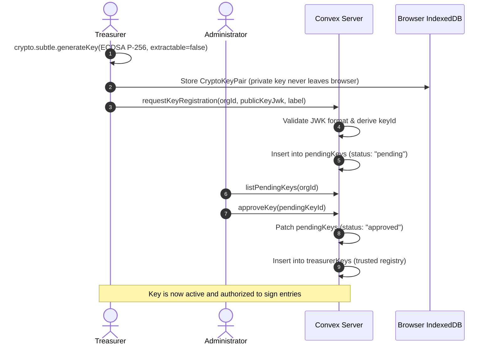
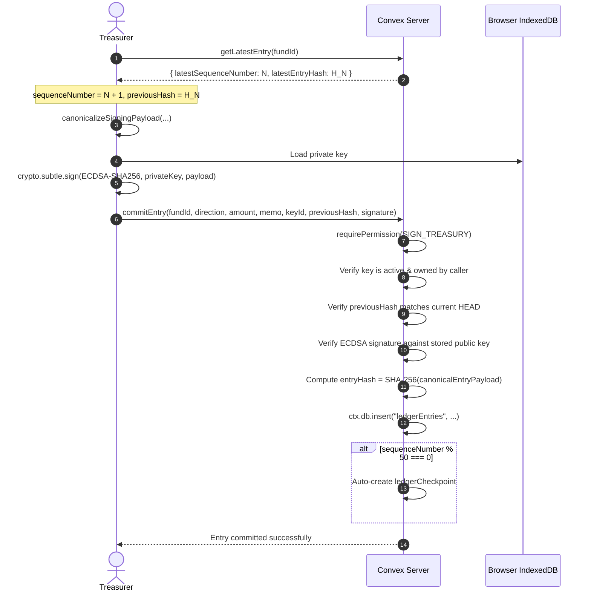

# Kasly Treasury & Cryptographic Ledger Engine

The **Kasly Treasury System** is a cryptographically verifiable, append-only ledger designed for organizational fund management. Built on [Convex](https://convex.dev/) and the W3C [Web Cryptography API](https://www.w3.org/TR/WebCryptoAPI/), it provides non-repudiation, mathematical tamper evidence, and complete auditability inspired by Git's commit history and financial transparency logs.

---

## 1. Core Architectural Invariants

| Principle | Architectural Rule | Technical Guarantee |
| :--- | :--- | :--- |
| **Append-Only Immutability** | Ledger entries can only be inserted, never edited, patched, or deleted. | Historical entries form an immutable linear chain. Corrections are applied via compensating entries. |
| **Derived Balances** | Fund balances are never stored as static state. | Balance is dynamically computed by replaying ledger credits and debits from genesis (or nearest checkpoint). |
| **Cryptographic Hash Chaining** | Every entry includes a SHA-256 digest of the previous entry (`previousHash`). | Any retro-active alteration of historical data invalidates all downstream hashes and breaks the chain. |
| **Non-Repudiation via Client Keys** | Treasurers sign transactions using private keys stored non-extractably in browser IndexedDB. | The server never holds private keys. A valid signature proves the authenticating treasurer authorized the transaction. |
| **Zero-Trust Key Ceremony** | Public keys must be submitted as requests and explicitly approved by organization admins. | Prevents rogue treasurers from signing entries without prior authorization. |
| **Independent Per-Fund Chains** | Each fund maintains its own linear sequence numbers and hash chain. | High write concurrency across funds without database Optimistic Concurrency Control (OCC) conflicts. |

---

## 2. System Architecture & Cryptographic Workflow

```
┌──────────────────────────────────────────────────────────────────────────────────┐
│                             Treasurer Client (Browser)                           │
│                                                                                  │
│   1. Generate Keypair ──► Web Crypto (ECDSA P-256) ──► IndexedDB (Non-extractable)│
│                                │                                                 │
│                                ▼ Export Public Key JWK                           │
│                     requestKeyRegistration()                                     │
│                                │                                                 │
│   2. Sign Transaction          ▼                                                 │
│      Fetch HEAD State ◄── getLatestEntry(fundId)                                 │
│      Build Canonical Payload ──► signLedgerPayload(privateKey) ──► Signature    │
│      Submit Signed Entry ──────► commitEntry()                                   │
└────────────────────────────────────────┬─────────────────────────────────────────┘
                                         │ WebSocket / HTTPS
                                         ▼
┌──────────────────────────────────────────────────────────────────────────────────┐
│                              Convex Server Layer                                 │
│                                                                                  │
│   1. Authorization Guardrail ──► requirePermission(SIGN_TREASURY)                │
│   2. Key & Ownership Check  ──► Verify keyId is active & owned by caller         │
│   3. Concurrency Lock       ──► Verify client previousHash === chain HEAD hash    │
│   4. Digital Signature      ──► crypto.subtle.verify(publicKey, sig, canonical)  │
│   5. Chain Linkage          ──► entryHash = SHA-256(canonicalEntryPayload)       │
│   6. Append to Table        ──► ctx.db.insert("ledgerEntries", ...)              │
│   7. Auto-Checkpointing     ──► Every 50 entries, snapshot running balance        │
└──────────────────────────────────────────────────────────────────────────────────┘
```

---

## 3. Cryptographic Protocol Specification

### A. Algorithm Suite
- **Signature Scheme**: `ECDSA` over the `P-256` (secp256r1) elliptic curve.
- **Hash Function**: `SHA-256` (FIPS 180-4).
- **Signature Encoding**: 64-byte raw IEEE P1363 ($r \parallel s$), encoded in **Base64URL** without padding.

### B. Canonical JSON Serialization
To guarantee byte-level deterministic hashing across heterogeneous environments (browsers, Node.js, Convex V8), payload properties are recursively sorted in lexicographical order with no extraneous whitespace:

$$\text{Canonical}(O) = \{ k_1: v_1, k_2: v_2, \dots \} \quad \text{where } k_1 < k_2 < \dots$$

### C. Signing Payload (Client Commitment)
The treasurer signs a canonical JSON representation of the transaction intent:
```json
{
  "amount": 500000,
  "direction": "credit",
  "fundId": "jh78...",
  "keyId": "9f8a1b2c3d4e5f60",
  "memo": "Monthly membership dues - August 2026",
  "previousHash": "a1b2c3...",
  "sequenceNumber": 42
}
```

### D. Full Entry Hash (Chain Linkage)
The immutable entry hash stored in `entryHash` binds the client signature, server timestamp, and signer identity:
```json
{
  "amount": 500000,
  "direction": "credit",
  "fundId": "jh78...",
  "keyId": "9f8a1b2c3d4e5f60",
  "memo": "Monthly membership dues - August 2026",
  "organizationId": "kg72...",
  "previousHash": "a1b2c3...",
  "sequenceNumber": 42,
  "signature": "MEQCIAz...",
  "signerId": "jx71...",
  "timestamp": 1787483920192,
  "transferId": "d3b07384-..."
}
```

$$\text{EntryHash}_n = \text{SHA-256}(\text{Canonical}(\text{EntryPayload}_n))$$

$$\text{PreviousHash}_n = \begin{cases} \text{"GENESIS"}, & \text{if } n = 1 \\ \text{EntryHash}_{n-1}, & \text{if } n > 1 \end{cases}$$

### E. Public Key Fingerprint (`keyId`)
Every public key is uniquely identified by a 16-character hexadecimal fingerprint derived from its canonical JWK:

$$\text{KeyId} = \text{SHA-256}(\text{Canonical}(\{ \text{crv}: \text{"P-256"}, \text{kty}: \text{"EC"}, \text{x}: \dots, \text{y}: \dots \}))[0..16]$$

---

## 4. Database Schema Specifications

### A. `funds` Table
Represents an isolated financial fund/account within an organization.

```typescript
funds: defineTable({
  organizationId: v.id("organizations"),
  name: v.string(),                    // Fund display name (e.g. "General Operating Fund")
  description: v.optional(v.string()), // Optional account purpose or description
  currency: v.string(),               // ISO currency code (e.g. "IDR", "USD") - IMMUTABLE
  createdBy: v.id("users"),           // User who provisioned the fund
  isArchived: v.boolean(),            // Archival status; archived funds reject new entries
})
  .index("by_organizationId", ["organizationId"])
  .index("by_organizationId_and_isArchived", ["organizationId", "isArchived"]),
```

### B. `pendingKeys` Table
Stores unapproved public keys generated during the zero-trust key ceremony.

```typescript
pendingKeys: defineTable({
  organizationId: v.id("organizations"),
  userId: v.id("users"),               // Treasurer requesting registration
  publicKeyJwk: v.string(),            // JWK serialized ECDSA P-256 public key
  keyId: v.string(),                   // 16-char hex fingerprint
  label: v.optional(v.string()),       // Device/hardware identifier (e.g. "Office MacBook")
  requestedAt: v.number(),             // Submission timestamp
  status: v.string(),                  // "pending" | "approved" | "rejected"
  reviewedBy: v.optional(v.id("users")), // Admin who reviewed the request
  reviewedAt: v.optional(v.number()),  // Review timestamp
})
  .index("by_organizationId", ["organizationId"])
  .index("by_organizationId_and_status", ["organizationId", "status"])
  .index("by_keyId", ["keyId"]),
```

### C. `treasurerKeys` Table
Stores approved public keys authorized to sign ledger transactions.

```typescript
treasurerKeys: defineTable({
  organizationId: v.id("organizations"),
  userId: v.id("users"),               // Treasurer identity
  publicKeyJwk: v.string(),            // Canonical JWK public key
  keyId: v.string(),                   // 16-char hex fingerprint
  label: v.optional(v.string()),       // Human-readable key alias
  registeredAt: v.number(),            // Approval timestamp
  registeredBy: v.id("users"),         // Admin who authorized the key
  revokedAt: v.optional(v.number()),   // Revocation timestamp (null if active)
})
  .index("by_organizationId", ["organizationId"])
  .index("by_organizationId_and_userId", ["organizationId", "userId"])
  .index("by_keyId", ["keyId"]),
```

### D. `ledgerEntries` Table
The immutable append-only hash chain of financial credits and debits.

```typescript
ledgerEntries: defineTable({
  organizationId: v.id("organizations"),
  fundId: v.id("funds"),
  sequenceNumber: v.number(),          // Monotonically increasing per fund (1, 2, 3...)
  previousHash: v.string(),            // SHA-256 digest of previous entry or "GENESIS"
  entryHash: v.string(),               // SHA-256 digest of this canonical entry
  timestamp: v.number(),               // Server-authoritative commit timestamp
  direction: v.string(),               // "credit" (increase) | "debit" (decrease)
  amount: v.number(),                  // Integer in smallest currency units (e.g. cents/Rupiah)
  memo: v.string(),                    // Transaction audit description
  keyId: v.string(),                   // Signing key fingerprint
  signerId: v.id("users"),             // Authenticated user ID of the signer
  signature: v.string(),               // Base64URL raw ECDSA signature
  transferId: v.optional(v.string()),  // UUID linking paired transfer debit/credit
})
  .index("by_fundId", ["fundId"])
  .index("by_fundId_and_sequenceNumber", ["fundId", "sequenceNumber"])
  .index("by_organizationId", ["organizationId"])
  .index("by_organizationId_and_timestamp", ["organizationId", "timestamp"]),
```

### E. `ledgerCheckpoints` Table
Periodic snapshots of derived balance for $O(1)$ balance queries and fast audit verification.

```typescript
ledgerCheckpoints: defineTable({
  organizationId: v.id("organizations"),
  fundId: v.id("funds"),
  sequenceNumber: v.number(),          // Highest sequence number covered by this snapshot
  entryHash: v.string(),               // Hash of the entry at sequenceNumber
  balanceAtCheckpoint: v.number(),     // Cumulative balance at sequenceNumber
  createdAt: v.number(),               // Checkpoint creation timestamp
  createdBy: v.id("users"),            // User/system who triggered the snapshot
})
  .index("by_fundId", ["fundId"])
  .index("by_fundId_and_sequenceNumber", ["fundId", "sequenceNumber"]),
```

---

## 5. Granular Treasury Permissions

Integrated into Kasly's Discord-style RBAC hierarchy:

| Permission Flag | Scope | Default Role Assignment | Capabilities |
| :--- | :--- | :--- | :--- |
| `VIEW_TREASURY` | Content Access | `@everyone` (All Members), `Admin` | View funds, read derived balances, inspect ledger history, run chain verification. |
| `SIGN_TREASURY` | Signing Authority | Designated Treasurers, `Admin` | Generate key registration requests, sign and commit debit/credit entries, execute transfers. |
| `MANAGE_TREASURY` | Administrative | `Admin` (Owner/Admins only) | Create/archive funds, approve/reject/revoke treasurer keys, trigger manual checkpoints, export audit ledgers. |

---

## 6. End-to-End Execution Lifecycles

### A. Zero-Trust Key Ceremony Flow


### B. Transaction Signing & Append-Only Commit Flow


### C. Atomic Inter-Fund Transfer Flow
Moving funds between two accounts (e.g. Operating Fund $\rightarrow$ Reserve Fund) executes as a **single atomic mutation**:
1. Client generates two signed payloads: a `debit` on Source Fund and a `credit` on Destination Fund.
2. Server generates a shared UUID `transferId`.
3. Both entries are validated and committed inside the same ACID Convex transaction.
4. If either signature, hash chain, or authorization fails, the entire transfer transaction rolls back with zero partial writes.

---

## 7. Complete API Reference

### Funds (`convex/treasury/funds.ts`)

#### `list` *(Query)*
Lists funds in an organization with their real-time derived balance.
- **Args**: `organizationId: v.id("organizations"), includeArchived: v.optional(v.boolean())`
- **Permission**: `VIEW_TREASURY`
- **Returns**: `Array<{ _id, name, description, currency, createdBy, isArchived, balance }>`

#### `get` *(Query)*
Fetches a single fund by ID with its derived balance.
- **Args**: `fundId: v.id("funds")`
- **Permission**: `VIEW_TREASURY`
- **Returns**: `Doc<"funds"> & { balance: number } | null`

#### `create` *(Mutation)*
Creates a new fund with an immutable currency.
- **Args**: `organizationId: v.id("organizations"), name: v.string(), currency: v.string(), description: v.optional(v.string())`
- **Permission**: `MANAGE_TREASURY`
- **Returns**: `Id<"funds">`

#### `update` *(Mutation)*
Updates fund name or description. Currency cannot be changed.
- **Args**: `fundId: v.id("funds"), name: v.optional(v.string()), description: v.optional(v.string())`
- **Permission**: `MANAGE_TREASURY`
- **Returns**: `null`

#### `archive` / `unarchive` *(Mutations)*
Toggles archival status of a fund.
- **Args**: `fundId: v.id("funds")`
- **Permission**: `MANAGE_TREASURY`
- **Returns**: `null`

---

### Keys (`convex/treasury/keys.ts`)

#### `requestKeyRegistration` *(Mutation)*
Submits a public key for admin approval.
- **Args**: `organizationId: v.id("organizations"), publicKeyJwk: v.string(), label: v.optional(v.string())`
- **Permission**: `SIGN_TREASURY`
- **Returns**: `string` (Key fingerprint `keyId`)

#### `listPendingKeys` *(Query)*
Lists pending key requests with user metadata.
- **Args**: `organizationId: v.id("organizations")`
- **Permission**: `MANAGE_TREASURY`
- **Returns**: `Array<{ _id, userId, userName, userEmail, keyId, publicKeyJwk, label, requestedAt, status }>`

#### `approveKey` *(Mutation)*
Approves a pending key and registers it in `treasurerKeys`.
- **Args**: `pendingKeyId: v.id("pendingKeys")`
- **Permission**: `MANAGE_TREASURY`
- **Returns**: `string` (`keyId`)

#### `rejectKey` *(Mutation)*
Rejects a pending key request.
- **Args**: `pendingKeyId: v.id("pendingKeys")`
- **Permission**: `MANAGE_TREASURY`
- **Returns**: `null`

#### `revokeKey` *(Mutation)*
Revokes an active key. Historical entries signed by this key remain valid.
- **Args**: `treasurerKeyId: v.id("treasurerKeys")`
- **Permission**: `MANAGE_TREASURY`
- **Returns**: `null`

#### `listActiveKeys` *(Query)*
Lists all registered keys (both active and revoked) in the organization.
- **Args**: `organizationId: v.id("organizations")`
- **Permission**: `MANAGE_TREASURY`
- **Returns**: `Array<Doc<"treasurerKeys"> & { isRevoked: boolean, userName?, userEmail?, registeredByName? }>`

#### `getMyKeys` *(Query)*
Returns all registered keys belonging to the authenticated caller.
- **Args**: `organizationId: v.id("organizations")`
- **Permission**: `SIGN_TREASURY`
- **Returns**: `Array<Doc<"treasurerKeys"> & { isRevoked: boolean }>`

---

### Ledger (`convex/treasury/ledger.ts`)

#### `getLatestEntry` *(Query)*
Returns the current HEAD sequence number and hash for pre-sign payload assembly.
- **Args**: `fundId: v.id("funds")`
- **Permission**: `SIGN_TREASURY`
- **Returns**: `{ fundId, organizationId, isArchived, latestSequenceNumber, latestEntryHash, nextSequenceNumber, nextPreviousHash }`

#### `commitEntry` *(Mutation)*
Appends a signed transaction to the ledger.
- **Args**: `fundId: v.id("funds"), direction: "credit" | "debit", amount: v.number(), memo: v.string(), keyId: v.string(), previousHash: v.string(), signature: v.string()`
- **Permission**: `SIGN_TREASURY`
- **Returns**: `{ entryId: Id<"ledgerEntries">, sequenceNumber: number, entryHash: string, timestamp: number }`

#### `transfer` *(Mutation)*
Atomically executes a paired debit and credit across two funds.
- **Args**: `sourceFundId, destinationFundId, amount, memo, keyId, sourcePreviousHash, sourceSignature, destinationPreviousHash, destinationSignature`
- **Permission**: `SIGN_TREASURY`
- **Returns**: `{ transferId: string, sourceEntry, destinationEntry }`

#### `listEntries` *(Query)*
Lists paginated ledger entries in reverse chronological order.
- **Args**: `fundId: v.id("funds"), limit: v.optional(v.number())`
- **Permission**: `VIEW_TREASURY`
- **Returns**: `Array<Doc<"ledgerEntries"> & { signerName?: string }>`

#### `getBalance` *(Query)*
Derives the current balance of a fund from its latest checkpoint.
- **Args**: `fundId: v.id("funds")`
- **Permission**: `VIEW_TREASURY`
- **Returns**: `number`

#### `getBalances` *(Query)*
Derives balances for all funds in an organization.
- **Args**: `organizationId: v.id("organizations")`
- **Permission**: `VIEW_TREASURY`
- **Returns**: `Array<{ fundId, name, currency, balance, isArchived }>`

#### `verifyChain` *(Query)*
Cryptographically audits a fund from genesis to HEAD, validating every hash and signature.
- **Args**: `fundId: v.id("funds")`
- **Permission**: `VIEW_TREASURY`
- **Returns**: `{ isValid: boolean, totalEntries: number, verifiedAt: number, error?: string, failedAtSequence?: number }`

#### `exportLedger` *(Query)*
Exports the complete, verifiable ledger state for offline compliance audits.
- **Args**: `fundId: v.id("funds")`
- **Permission**: `MANAGE_TREASURY`
- **Returns**: `{ exportedAt, fund, derivedBalance, checkpoints, keys, entries }`

---

### Checkpoints (`convex/treasury/checkpoints.ts`)

#### `createCheckpoint` *(Mutation)*
Creates an admin snapshot of the fund's current balance and HEAD hash.
- **Args**: `fundId: v.id("funds")`
- **Permission**: `MANAGE_TREASURY`
- **Returns**: `Id<"ledgerCheckpoints">`

#### `listCheckpoints` *(Query)*
Lists all snapshots created for a fund.
- **Args**: `fundId: v.id("funds")`
- **Permission**: `MANAGE_TREASURY`
- **Returns**: `Array<Doc<"ledgerCheckpoints"> & { createdByName?: string }>`

#### `verifyCheckpoint` *(Query)*
Replays ledger from genesis to verify a checkpoint's balance and hash integrity.
- **Args**: `checkpointId: v.id("ledgerCheckpoints")`
- **Permission**: `VIEW_TREASURY`
- **Returns**: `{ isValid: boolean, checkpointSequenceNumber: number, recordedBalance: number, recomputedBalance: number, hashMatches: boolean, error?: string }`

---

## 8. Client-Side Cryptography Integration

Frontend applications import the helper module located at [`src/lib/treasury-crypto.ts`](file:///d:/coding/BoredKevin/kasly/src/lib/treasury-crypto.ts):

```typescript
import {
  generateTreasurerKeypair,
  exportPublicKeyJwk,
  computeKeyIdFromJwk,
  storeKeypair,
  loadKeypair,
  signLedgerPayload,
} from "@/lib/treasury-crypto";

// 1. Key Generation & Registration Ceremony
const keypair = await generateTreasurerKeypair();
const publicKeyJwk = await exportPublicKeyJwk(keypair.publicKey);
const keyId = await computeKeyIdFromJwk(publicKeyJwk);
await storeKeypair(keyId, keypair, publicKeyJwk, "MacBook Pro");

// Submit to Convex
await convex.mutation(api.treasury.keys.requestKeyRegistration, {
  organizationId,
  publicKeyJwk,
  label: "MacBook Pro",
});

// 2. Signing & Committing a Ledger Entry
const storedKey = await loadKeypair(keyId);
const head = await convex.query(api.treasury.ledger.getLatestEntry, { fundId });

const payload = {
  fundId,
  sequenceNumber: head.nextSequenceNumber,
  previousHash: head.nextPreviousHash,
  direction: "credit" as const,
  amount: 250000, // Rp 250.000 in integer units
  memo: "Semester Registration Fee",
  keyId,
};

const { signature } = await signLedgerPayload(storedKey.privateKey, payload);

await convex.mutation(api.treasury.ledger.commitEntry, {
  ...payload,
  signature,
});
```

---

## 9. Automated Member Dues & Payments System

The **Dues System** provides a recurring, scheduled dues mechanism designed for organizations, classes, and communities. It coordinates automated cycle generation via dynamic scheduling while strictly enforcing the **Cryptographic Ledger Engine** for every financial payment credit. Dues configurations, cycles, and memberships are scoped **per fund**, allowing each fund account (e.g. Kas Kelas, Kas Praktikum, Event Fund) to maintain independent dues schedules, amounts, and spreadsheets.

### A. Architecture & Cryptographic Workflow

```
┌────────────────────────────────────────────────────────┐
│                   duesConfig (Per Fund)                │
│  fundId, organizationId, isEnabled,                    │
│  intervalType (weekly/monthly/custom_days),            │
│  intervalValue, amount, nextScheduledAt, jobId         │
└──────────────────────────┬─────────────────────────────┘
                           │ Dynamic self-rescheduling cron
                           │ ctx.scheduler.runAt()
                           ▼
┌────────────────────────────────────────────────────────┐
│                   duesEvents (Per Cycle, Per Fund)     │
│  fundId, organizationId, periodLabel ("August 2026"),  │
│  dueDate, amount snapshot, totalMembers, paidCount     │
└──────────────────────────┬─────────────────────────────┘
                           │ One row per active member
                           ▼
┌────────────────────────────────────────────────────────┐
│                duesMemberships (Per Member, Per Fund)  │
│  fundId, duesEventId, userId, hasPaid, paidAt,         │
│  ledgerEntryId                                         │
└──────────────────────────┬─────────────────────────────┘
                           │ Treasurer records payment
                           │ Browser ECDSA P-256 Signature
                           ▼
┌────────────────────────────────────────────────────────┐
│               ledgerEntries (CLE Append-Only)          │
│  direction: "credit", amount: (periods × amount),       │
│  memo: "Dues Payment (2 cycles) - Alice",              │
│  keyId, previousHash, signature, duesEventId           │
└────────────────────────────────────────────────────────┘
```

### B. Dues Database Schemas

#### 1. `duesConfig` Table
Stores the recurring dues schedule configuration scoped to a specific fund.
- **Fields**: `organizationId`, `fundId`, `isEnabled`, `intervalType` (`"weekly"` | `"monthly"` | `"custom_days"`), `intervalValue`, `amount`, `nextScheduledAt`, `scheduledJobId`, `createdBy`, `updatedBy`.
- **Indexes**: `by_fundId`, `by_organizationId`.

#### 2. `duesEvents` Table
Snapshots a generated dues cycle created by the automated scheduler for a specific fund.
- **Fields**: `organizationId`, `fundId`, `periodLabel` (e.g. "August 2026"), `dueDate`, `amount` (snapshotted at creation), `totalMembers`, `paidCount`.
- **Indexes**: `by_fundId`, `by_fundId_and_dueDate`, `by_organizationId`, `by_organizationId_and_dueDate`.

#### 3. `duesMemberships` Table
Tracks individual member payment and waiver statuses per cycle in a fund.
- **Fields**: `duesEventId`, `organizationId`, `fundId`, `memberId`, `userId`, `hasPaid`, `isWaived`, `paidAt`, `ledgerEntryId`, `recordedBy`.
- **Indexes**: `by_duesEventId`, `by_duesEventId_and_memberId`, `by_fundId_and_userId`, `by_fundId_and_hasPaid`, `by_organizationId_and_userId`, `by_organizationId_and_hasPaid`.

### C. Dues API Reference (`convex/treasury/dues.ts`)

| Function | Type | Permission | Description |
| :--- | :--- | :--- | :--- |
| `getDuesConfig` | Query | `MANAGE_TREASURY` | Fetches active fund dues configuration (`organizationId`, `fundId`). |
| `upsertDuesConfig` | Mutation | `MANAGE_TREASURY` | Configures interval, amount, enables/disables, and reschedules the cron job for a fund. |
| `disableDues` | Mutation | `MANAGE_TREASURY` | Disables automated schedule and cancels pending scheduled jobs for a fund. |
| `createManualDuesCycle` | Mutation | `MANAGE_TREASURY` | Manually creates a dues cycle for any date (past or present) with custom amount & period label. |
| `createBatchDuesCycles` | Mutation | `MANAGE_TREASURY` | Batch creates multiple dues cycles across a period range (e.g. Week 20–35) with duplicate guards. |
| `triggerDuesCycleNow` | Mutation | `MANAGE_TREASURY` | Manually triggers a dues cycle on demand for a fund. |
| `listDuesEvents` | Query | `VIEW_TREASURY` | Lists all historical and active dues cycles for a fund. |
| `getDuesSummary` | Query | `VIEW_TREASURY` | Returns aggregated metrics for a fund (unpaid dues, cycle counts, status). |
| `getDuesSpreadsheet` | Query | `VIEW_TREASURY` | Returns the full Excel-like 2D grid matrix of members × periods for a fund. |
| `getMemberUnpaidPeriods` | Query | `VIEW_TREASURY` | Returns ordered list of outstanding unpaid periods for a member in a fund. |
| `markDuesPaid` | Mutation | `SIGN_TREASURY` | Validates ECDSA signature and appends a single CLE credit entry covering N oldest unpaid periods for a fund. |
| `waiveDues` | Mutation | `SIGN_TREASURY` | Signs and appends a zero-amount `entryType: "waiver"` entry to exempt a member obligation. |

